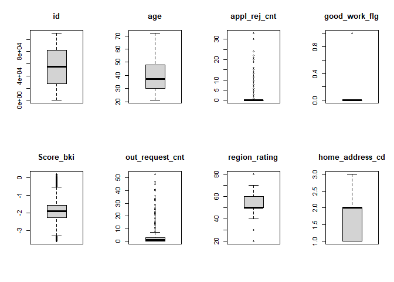
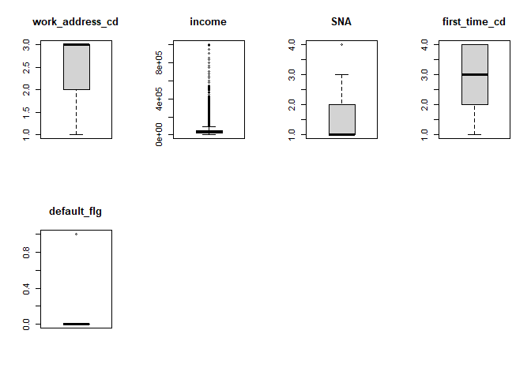
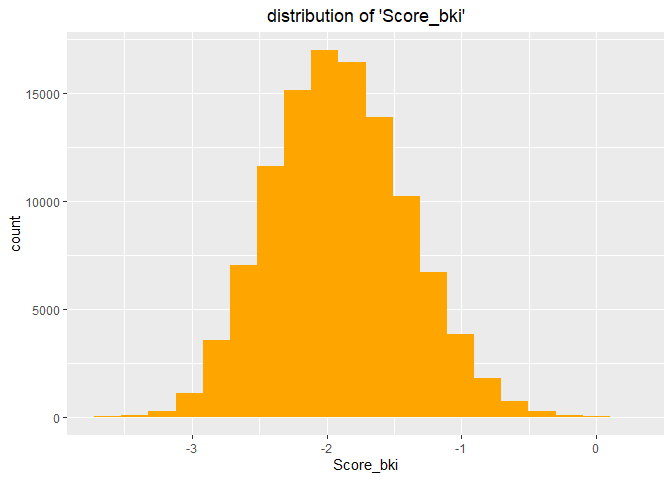
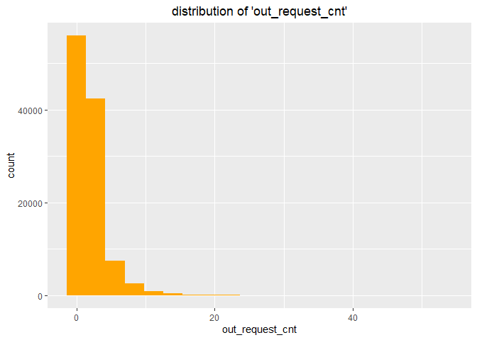
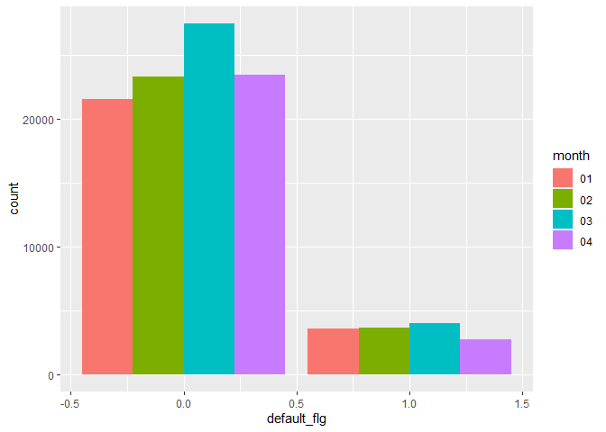
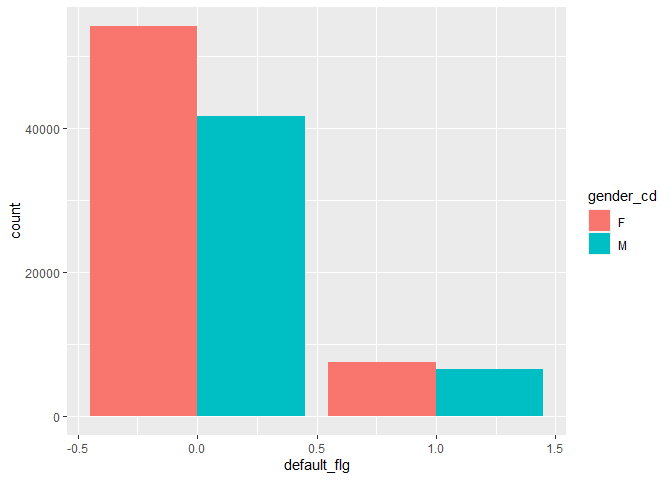
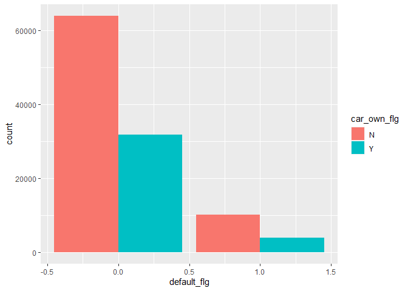
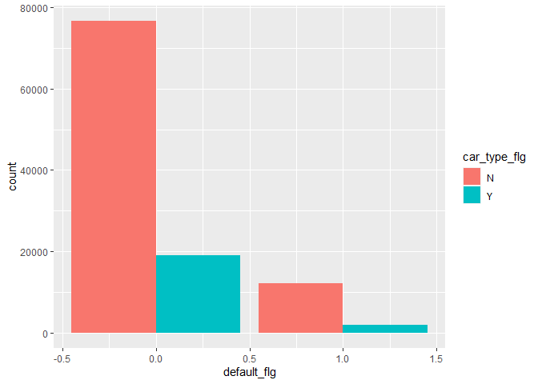
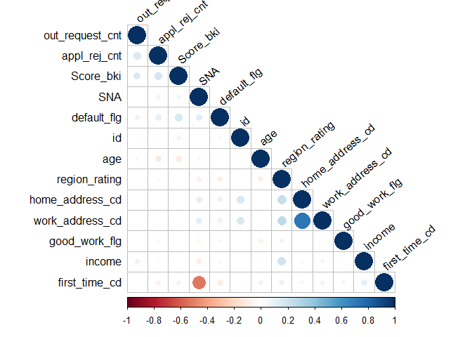

1. Problem Definition
=====================

1.1 Defining the Question
-------------------------

Create a credit scoring model to predict whether a new customer will
default based on the historical data in the given dataset. Select one or
several suitable learning algorithms and a suitable metric for assessing
quality model.

1.3 Defining the Metric of Success
----------------------------------

Since the problem we are tackling is a classification problem, we will
use classification reports and confusion matrices as well as accuracy
and precision scores to measure the success of the models used.

1.4 Understanding the Context
-----------------------------

Talar is a finance app that offers microloans to its users in Kenya,
Philippines and Tanzania. It uses a variety of information, from basic
biographical data to the loan applications that come through daily. You
work with the product team as a data scientist to help create effective
credit scoring models used to assess different customer segments

1.5 Experimental Design taken
-----------------------------

-   load libraries and dataset
-   clean dataset:
    -   deal with duplicate and/or missing values
    -   deal with outliers, where necessary
    -   deal with other anomalies in the data, where necessary
-   carry out exploratory data analysis
-   carry out feature engineering
-   carry out modeling
-   tune hyperparameters
-   feature selection
-   alternative models
-   summarize and provide recommendations
-   challenge the solution

2. Data Sourcing
================

The dataset was obtained from the AfterWork Fellowship Program Webinar
where Credit Scoring Models were being explored

``` r
## Loading packages that we will use during our analysis
library("dplyr")
library("purrr")
library('tidyverse')
library('magrittr')
library('corrplot')
library('caret')
library('skimr')
library(readr)
```

``` r
train <- read_csv("train.csv")
## previewing first 6 rows
head(train)
```

    ## # A tibble: 6 x 19
    ##      id application_dt education_cd gender_cd   age car_own_flg car_type_flg
    ##   <dbl> <chr>          <chr>        <chr>     <dbl> <chr>       <chr>       
    ## 1     1 01JAN2014      SCH          M            27 Y           Y           
    ## 2     2 01JAN2014      GRD          F            26 N           N           
    ## 3     3 01JAN2014      SCH          M            35 N           N           
    ## 4     4 01JAN2014      GRD          F            35 N           N           
    ## 5     5 01JAN2014      UGR          F            24 N           N           
    ## 6     6 01JAN2014      SCH          M            35 Y           Y           
    ## # ... with 12 more variables: appl_rej_cnt <dbl>, good_work_flg <dbl>,
    ## #   Score_bki <dbl>, out_request_cnt <dbl>, region_rating <dbl>,
    ## #   home_address_cd <dbl>, work_address_cd <dbl>, income <dbl>, SNA <dbl>,
    ## #   first_time_cd <dbl>, Air_flg <chr>, default_flg <dbl>

``` r
##previewing the last 6 rows of the data set
tail(train)
```

    ## # A tibble: 6 x 19
    ##       id application_dt education_cd gender_cd   age car_own_flg car_type_flg
    ##    <dbl> <chr>          <chr>        <chr>     <dbl> <chr>       <chr>       
    ## 1 110143 30APR2014      GRD          F            42 N           N           
    ## 2 110144 30APR2014      SCH          M            26 Y           Y           
    ## 3 110145 30APR2014      GRD          F            39 N           N           
    ## 4 110146 30APR2014      UGR          M            27 Y           N           
    ## 5 110147 30APR2014      SCH          F            52 Y           N           
    ## 6 110148 30APR2014      SCH          F            21 N           N           
    ## # ... with 12 more variables: appl_rej_cnt <dbl>, good_work_flg <dbl>,
    ## #   Score_bki <dbl>, out_request_cnt <dbl>, region_rating <dbl>,
    ## #   home_address_cd <dbl>, work_address_cd <dbl>, income <dbl>, SNA <dbl>,
    ## #   first_time_cd <dbl>, Air_flg <chr>, default_flg <dbl>

Description of fields: ● id - an anonymous identifier of the applicant ●
application\_dt - application submission date ● sample\_cd - sample
category ● education\_cd - education ● gender\_cd - gender ● age - age
of the applicant ● car\_own\_flg - vehicle presence flag ●
car\_type\_flg - the foreign car presence flag ● appl\_rej\_cnt - the
number of denied past claims ● good\_work\_flg - flag for “good” work ●
Score\_bki - a quick score based on data from the credit bureau ●
out\_request\_cnt - number of requests in the bureau ● region\_rating -
rating of the region ● home\_address\_cd - home address categorizer ●
work\_address\_cd - work address categorizer ● income - the income of
the applicant ● SNA - the applicant’s relationship with customers ●
first\_time\_cd - prescription of information about the applicant ●
air\_flg - presence of the passport passport ● default\_flg - default
credit flag - target variable

``` r
## Previewing the shape of our dataset
dim(train)
```

    ## [1] 110148     19

``` r
### we have 110148          rows and 19 columns!!!BAM!!

#checking the datatypes on the columns 
sapply(train, class)
```

    ##              id  application_dt    education_cd       gender_cd             age 
    ##       "numeric"     "character"     "character"     "character"       "numeric" 
    ##     car_own_flg    car_type_flg    appl_rej_cnt   good_work_flg       Score_bki 
    ##     "character"     "character"       "numeric"       "numeric"       "numeric" 
    ## out_request_cnt   region_rating home_address_cd work_address_cd          income 
    ##       "numeric"       "numeric"       "numeric"       "numeric"       "numeric" 
    ##             SNA   first_time_cd         Air_flg     default_flg 
    ##       "numeric"       "numeric"     "character"       "numeric"

``` r
##checking for structure is using the str()
str(train)
```

    ## tibble [110,148 x 19] (S3: spec_tbl_df/tbl_df/tbl/data.frame)
    ##  $ id             : num [1:110148] 1 2 3 4 5 6 7 8 9 10 ...
    ##  $ application_dt : chr [1:110148] "01JAN2014" "01JAN2014" "01JAN2014" "01JAN2014" ...
    ##  $ education_cd   : chr [1:110148] "SCH" "GRD" "SCH" "GRD" ...
    ##  $ gender_cd      : chr [1:110148] "M" "F" "M" "F" ...
    ##  $ age            : num [1:110148] 27 26 35 35 24 35 35 55 34 42 ...
    ##  $ car_own_flg    : chr [1:110148] "Y" "N" "N" "N" ...
    ##  $ car_type_flg   : chr [1:110148] "Y" "N" "N" "N" ...
    ##  $ appl_rej_cnt   : num [1:110148] 0 0 0 0 0 0 0 0 0 0 ...
    ##  $ good_work_flg  : num [1:110148] 0 0 1 1 0 0 0 0 0 0 ...
    ##  $ Score_bki      : num [1:110148] -1.92 -1.15 -1.73 -2.55 -1.91 ...
    ##  $ out_request_cnt: num [1:110148] 0 2 0 2 1 4 6 1 2 3 ...
    ##  $ region_rating  : num [1:110148] 40 60 40 20 50 40 60 40 50 40 ...
    ##  $ home_address_cd: num [1:110148] 2 2 1 2 2 2 1 2 1 1 ...
    ##  $ work_address_cd: num [1:110148] 3 3 2 3 3 3 1 3 1 2 ...
    ##  $ income         : num [1:110148] 32000 50000 20000 80000 27000 35000 20000 8000 30000 60000 ...
    ##  $ SNA            : num [1:110148] 1 2 4 1 1 4 1 1 1 3 ...
    ##  $ first_time_cd  : num [1:110148] 4 1 3 3 2 3 3 3 4 3 ...
    ##  $ Air_flg        : chr [1:110148] "N" "N" "N" "N" ...
    ##  $ default_flg    : num [1:110148] 0 0 0 0 0 0 0 1 0 0 ...
    ##  - attr(*, "spec")=
    ##   .. cols(
    ##   ..   id = col_double(),
    ##   ..   application_dt = col_character(),
    ##   ..   education_cd = col_character(),
    ##   ..   gender_cd = col_character(),
    ##   ..   age = col_double(),
    ##   ..   car_own_flg = col_character(),
    ##   ..   car_type_flg = col_character(),
    ##   ..   appl_rej_cnt = col_double(),
    ##   ..   good_work_flg = col_double(),
    ##   ..   Score_bki = col_double(),
    ##   ..   out_request_cnt = col_double(),
    ##   ..   region_rating = col_double(),
    ##   ..   home_address_cd = col_double(),
    ##   ..   work_address_cd = col_double(),
    ##   ..   income = col_double(),
    ##   ..   SNA = col_double(),
    ##   ..   first_time_cd = col_double(),
    ##   ..   Air_flg = col_character(),
    ##   ..   default_flg = col_double()
    ##   .. )

``` r
## We then a statistical summary of our dataset

summary(train)
```

    ##        id         application_dt     education_cd        gender_cd        
    ##  Min.   :     1   Length:110148      Length:110148      Length:110148     
    ##  1st Qu.: 27538   Class :character   Class :character   Class :character  
    ##  Median : 55075   Mode  :character   Mode  :character   Mode  :character  
    ##  Mean   : 55075                                                           
    ##  3rd Qu.: 82611                                                           
    ##  Max.   :110148                                                           
    ##       age        car_own_flg        car_type_flg        appl_rej_cnt    
    ##  Min.   :21.00   Length:110148      Length:110148      Min.   : 0.0000  
    ##  1st Qu.:30.00   Class :character   Class :character   1st Qu.: 0.0000  
    ##  Median :37.00   Mode  :character   Mode  :character   Median : 0.0000  
    ##  Mean   :39.25                                         Mean   : 0.2732  
    ##  3rd Qu.:48.00                                         3rd Qu.: 0.0000  
    ##  Max.   :72.00                                         Max.   :33.0000  
    ##  good_work_flg      Score_bki       out_request_cnt  region_rating  
    ##  Min.   :0.0000   Min.   :-3.6246   Min.   : 0.000   Min.   :20.00  
    ##  1st Qu.:0.0000   1st Qu.:-2.2604   1st Qu.: 0.000   1st Qu.:50.00  
    ##  Median :0.0000   Median :-1.9208   Median : 1.000   Median :50.00  
    ##  Mean   :0.1655   Mean   :-1.9045   Mean   : 2.005   Mean   :56.75  
    ##  3rd Qu.:0.0000   3rd Qu.:-1.5679   3rd Qu.: 3.000   3rd Qu.:60.00  
    ##  Max.   :1.0000   Max.   : 0.1998   Max.   :53.000   Max.   :80.00  
    ##  home_address_cd work_address_cd     income             SNA       
    ##  Min.   :1.000   Min.   :1.000   Min.   :   1000   Min.   :1.000  
    ##  1st Qu.:1.000   1st Qu.:2.000   1st Qu.:  20000   1st Qu.:1.000  
    ##  Median :2.000   Median :3.000   Median :  30000   Median :1.000  
    ##  Mean   :1.575   Mean   :2.498   Mean   :  41013   Mean   :1.732  
    ##  3rd Qu.:2.000   3rd Qu.:3.000   3rd Qu.:  48000   3rd Qu.:2.000  
    ##  Max.   :3.000   Max.   :3.000   Max.   :1000000   Max.   :4.000  
    ##  first_time_cd     Air_flg           default_flg    
    ##  Min.   :1.000   Length:110148      Min.   :0.0000  
    ##  1st Qu.:2.000   Class :character   1st Qu.:0.0000  
    ##  Median :3.000   Mode  :character   Median :0.0000  
    ##  Mean   :2.766                      Mean   :0.1268  
    ##  3rd Qu.:4.000                      3rd Qu.:0.0000  
    ##  Max.   :4.000                      Max.   :1.0000

DATA CLEANING
-------------

check for duplicated values
===========================

``` r
duplicated_rows<- train[duplicated(train),]

duplicated_rows
```

    ## # A tibble: 0 x 19
    ## # ... with 19 variables: id <dbl>, application_dt <chr>, education_cd <chr>,
    ## #   gender_cd <chr>, age <dbl>, car_own_flg <chr>, car_type_flg <chr>,
    ## #   appl_rej_cnt <dbl>, good_work_flg <dbl>, Score_bki <dbl>,
    ## #   out_request_cnt <dbl>, region_rating <dbl>, home_address_cd <dbl>,
    ## #   work_address_cd <dbl>, income <dbl>, SNA <dbl>, first_time_cd <dbl>,
    ## #   Air_flg <chr>, default_flg <dbl>

``` r
##  No duplicates found
```

``` r
# check for missing values

colSums(is.na(train))
```

    ##              id  application_dt    education_cd       gender_cd             age 
    ##               0               0             478               0               0 
    ##     car_own_flg    car_type_flg    appl_rej_cnt   good_work_flg       Score_bki 
    ##               0               0               0               0               0 
    ## out_request_cnt   region_rating home_address_cd work_address_cd          income 
    ##               0               0               0               0               0 
    ##             SNA   first_time_cd         Air_flg     default_flg 
    ##               0               0               0               0

``` r
##dropping missing values
train <- na.omit(train)
colSums(is.na(train))
```

    ##              id  application_dt    education_cd       gender_cd             age 
    ##               0               0               0               0               0 
    ##     car_own_flg    car_type_flg    appl_rej_cnt   good_work_flg       Score_bki 
    ##               0               0               0               0               0 
    ## out_request_cnt   region_rating home_address_cd work_address_cd          income 
    ##               0               0               0               0               0 
    ##             SNA   first_time_cd         Air_flg     default_flg 
    ##               0               0               0               0

``` r
# check the data types
#in R
sapply(train, class)
```

    ##              id  application_dt    education_cd       gender_cd             age 
    ##       "numeric"     "character"     "character"     "character"       "numeric" 
    ##     car_own_flg    car_type_flg    appl_rej_cnt   good_work_flg       Score_bki 
    ##     "character"     "character"       "numeric"       "numeric"       "numeric" 
    ## out_request_cnt   region_rating home_address_cd work_address_cd          income 
    ##       "numeric"       "numeric"       "numeric"       "numeric"       "numeric" 
    ##             SNA   first_time_cd         Air_flg     default_flg 
    ##       "numeric"       "numeric"     "character"       "numeric"

– Column specification ——————————————- cols( id = col\_double(),
application\_dt = col\_character(), education\_cd = col\_character(),
gender\_cd = col\_character(), age = col\_double(), car\_own\_flg =
col\_character(), car\_type\_flg = col\_character(), appl\_rej\_cnt =
col\_double(), good\_work\_flg = col\_double(), Score\_bki =
col\_double(), out\_request\_cnt = col\_double(), region\_rating =
col\_double(), home\_address\_cd = col\_double(), work\_address\_cd =
col\_double(), income = col\_double(), SNA = col\_double(),
first\_time\_cd = col\_double(), Air\_flg = col\_character(),
default\_flg = col\_double() )

R Console id <dbl> application\_dt <chr> education\_cd <chr> gender\_cd
<chr> 1 01JAN2014 SCH M  
2 01JAN2014 GRD F  
3 01JAN2014 SCH M  
4 01JAN2014 GRD F  
5 01JAN2014 UGR F  
6 01JAN2014 SCH M  
6 rows \| 1-4 of 19 columns tbl\_df 6 x 19 id <dbl> application\_dt
<chr> education\_cd <chr> 110143 30APR2014 GRD 110144 30APR2014 SCH
110145 30APR2014 GRD 110146 30APR2014 UGR 110147 30APR2014 SCH 110148
30APR2014 SCH 6 rows \| 1-3 of 19 columns tbl\_df 6 x 19 id <dbl>
application\_dt <chr> education\_cd <chr> gender\_cd <chr> age <dbl>
110143 30APR2014 GRD F 42  
110144 30APR2014 SCH M 26  
110145 30APR2014 GRD F 39  
110146 30APR2014 UGR M 27  
110147 30APR2014 SCH F 52  
110148 30APR2014 SCH F 21  
6 rows \| 1-5 of 19 columns Show in New WindowClear
OutputExpand/Collapse Output \[1\] 110148 19 id application\_dt
education\_cd gender\_cd “numeric” “character” “character” “character”
age car\_own\_flg car\_type\_flg appl\_rej\_cnt “numeric” “character”
“character” “numeric” good\_work\_flg Score\_bki out\_request\_cnt
region\_rating “numeric” “numeric” “numeric” “numeric” home\_address\_cd
work\_address\_cd income SNA “numeric” “numeric” “numeric” “numeric”
first\_time\_cd Air\_flg default\_flg “numeric” “character” “numeric”
tibble \[110,148 x 19\] (S3: spec\_tbl\_df/tbl\_df/tbl/data.frame) $ id
: num \[1:110148\] 1 2 3 4 5 6 7 8 9 10 … $ application\_dt : chr
\[1:110148\] “01JAN2014” “01JAN2014” “01JAN2014” “01JAN2014” … $
education\_cd : chr \[1:110148\] “SCH” “GRD” “SCH” “GRD” … $ gender\_cd
: chr \[1:110148\] “M” “F” “M” “F” … $ age : num \[1:110148\] 27 26 35
35 24 35 35 55 34 42 … $ car\_own\_flg : chr \[1:110148\] “Y” “N” “N”
“N” … $ car\_type\_flg : chr \[1:110148\] “Y” “N” “N” “N” … $
appl\_rej\_cnt : num \[1:110148\] 0 0 0 0 0 0 0 0 0 0 … $
good\_work\_flg : num \[1:110148\] 0 0 1 1 0 0 0 0 0 0 … $ Score\_bki :
num \[1:110148\] -1.92 -1.15 -1.73 -2.55 -1.91 … $ out\_request\_cnt:
num \[1:110148\] 0 2 0 2 1 4 6 1 2 3 … $ region\_rating : num
\[1:110148\] 40 60 40 20 50 40 60 40 50 40 … $ home\_address\_cd: num
\[1:110148\] 2 2 1 2 2 2 1 2 1 1 … $ work\_address\_cd: num \[1:110148\]
3 3 2 3 3 3 1 3 1 2 … $ income : num \[1:110148\] 32000 50000 20000
80000 27000 35000 20000 8000 30000 60000 … $ SNA : num \[1:110148\] 1 2
4 1 1 4 1 1 1 3 … $ first\_time\_cd : num \[1:110148\] 4 1 3 3 2 3 3 3 4
3 … $ Air\_flg : chr \[1:110148\] “N” “N” “N” “N” … $ default\_flg : num
\[1:110148\] 0 0 0 0 0 0 0 1 0 0 … - attr(\*, “spec”)= .. cols( .. id =
col\_double(), .. application\_dt = col\_character(), .. education\_cd =
col\_character(), .. gender\_cd = col\_character(), .. age =
col\_double(), .. car\_own\_flg = col\_character(), .. car\_type\_flg =
col\_character(), .. appl\_rej\_cnt = col\_double(), .. good\_work\_flg
= col\_double(), .. Score\_bki = col\_double(), .. out\_request\_cnt =
col\_double(), .. region\_rating = col\_double(), .. home\_address\_cd =
col\_double(), .. work\_address\_cd = col\_double(), .. income =
col\_double(), .. SNA = col\_double(), .. first\_time\_cd =
col\_double(), .. Air\_flg = col\_character(), .. default\_flg =
col\_double() .. ) id application\_dt education\_cd  
Min. : 1 Length:110148 Length:110148  
1st Qu.: 27538 Class :character Class :character  
Median : 55075 Mode :character Mode :character  
Mean : 55075  
3rd Qu.: 82611  
Max. :110148  
gender\_cd age car\_own\_flg  
Length:110148 Min. :21.00 Length:110148  
Class :character 1st Qu.:30.00 Class :character  
Mode :character Median :37.00 Mode :character  
Mean :39.25  
3rd Qu.:48.00  
Max. :72.00  
car\_type\_flg appl\_rej\_cnt good\_work\_flg  
Length:110148 Min. : 0.0000 Min. :0.0000  
Class :character 1st Qu.: 0.0000 1st Qu.:0.0000  
Mode :character Median : 0.0000 Median :0.0000  
Mean : 0.2732 Mean :0.1655  
3rd Qu.: 0.0000 3rd Qu.:0.0000  
Max. :33.0000 Max. :1.0000  
Score\_bki out\_request\_cnt region\_rating  
Min. :-3.6246 Min. : 0.000 Min. :20.00  
1st Qu.:-2.2604 1st Qu.: 0.000 1st Qu.:50.00  
Median :-1.9208 Median : 1.000 Median :50.00  
Mean :-1.9045 Mean : 2.005 Mean :56.75  
3rd Qu.:-1.5679 3rd Qu.: 3.000 3rd Qu.:60.00  
Max. : 0.1998 Max. :53.000 Max. :80.00  
home\_address\_cd work\_address\_cd income SNA  
Min. :1.000 Min. :1.000 Min. : 1000 Min. :1.000  
1st Qu.:1.000 1st Qu.:2.000 1st Qu.: 20000 1st Qu.:1.000  
Median :2.000 Median :3.000 Median : 30000 Median :1.000  
Mean :1.575 Mean :2.498 Mean : 41013 Mean :1.732  
3rd Qu.:2.000 3rd Qu.:3.000 3rd Qu.: 48000 3rd Qu.:2.000  
Max. :3.000 Max. :3.000 Max. :1000000 Max. :4.000  
first\_time\_cd Air\_flg default\_flg  
Min. :1.000 Length:110148 Min. :0.0000  
1st Qu.:2.000 Class :character 1st Qu.:0.0000  
Median :3.000 Mode :character Median :0.0000  
Mean :2.766 Mean :0.1268  
3rd Qu.:4.000 3rd Qu.:0.0000  
Max. :4.000 Max. :1.0000  
Show in New WindowClear OutputExpand/Collapse Output \[1\] FALSE FALSE
FALSE FALSE FALSE FALSE FALSE FALSE FALSE FALSE \[11\] FALSE FALSE FALSE
FALSE FALSE FALSE FALSE FALSE FALSE FALSE \[21\] FALSE FALSE FALSE FALSE
FALSE FALSE FALSE FALSE FALSE FALSE \[31\] FALSE FALSE FALSE FALSE FALSE
FALSE FALSE FALSE FALSE FALSE \[41\] FALSE FALSE FALSE FALSE FALSE FALSE
FALSE FALSE FALSE FALSE \[51\] FALSE FALSE FALSE FALSE FALSE FALSE FALSE
FALSE FALSE FALSE \[61\] FALSE FALSE FALSE FALSE FALSE FALSE FALSE FALSE
FALSE FALSE \[71\] FALSE FALSE FALSE FALSE FALSE FALSE FALSE FALSE FALSE
FALSE \[81\] FALSE FALSE FALSE FALSE FALSE FALSE FALSE FALSE FALSE FALSE
\[91\] FALSE FALSE FALSE FALSE FALSE FALSE FALSE FALSE FALSE FALSE
\[101\] FALSE FALSE FALSE FALSE FALSE FALSE FALSE FALSE FALSE FALSE
\[111\] FALSE FALSE FALSE FALSE FALSE FALSE FALSE FALSE FALSE FALSE
\[121\] FALSE FALSE FALSE FALSE FALSE FALSE FALSE FALSE FALSE FALSE
\[131\] FALSE FALSE FALSE FALSE FALSE FALSE FALSE FALSE FALSE FALSE
\[141\] FALSE FALSE FALSE FALSE FALSE FALSE FALSE FALSE FALSE FALSE
\[151\] FALSE FALSE FALSE FALSE FALSE FALSE FALSE FALSE FALSE FALSE
\[161\] FALSE FALSE FALSE FALSE FALSE FALSE FALSE FALSE FALSE FALSE
\[171\] FALSE FALSE FALSE FALSE FALSE FALSE FALSE FALSE FALSE FALSE
\[181\] FALSE FALSE FALSE FALSE FALSE FALSE FALSE FALSE FALSE FALSE
\[191\] FALSE FALSE FALSE FALSE FALSE FALSE FALSE FALSE FALSE FALSE
\[201\] FALSE FALSE FALSE FALSE FALSE FALSE FALSE FALSE FALSE FALSE
\[211\] FALSE FALSE FALSE FALSE FALSE FALSE FALSE FALSE FALSE FALSE
\[221\] FALSE FALSE FALSE FALSE FALSE FALSE FALSE FALSE FALSE FALSE
\[231\] FALSE FALSE FALSE FALSE FALSE FALSE FALSE FALSE FALSE FALSE
\[241\] FALSE FALSE FALSE FALSE FALSE FALSE FALSE FALSE FALSE FALSE
\[251\] FALSE FALSE FALSE FALSE FALSE FALSE FALSE FALSE FALSE FALSE
\[261\] FALSE FALSE FALSE FALSE FALSE FALSE FALSE FALSE FALSE FALSE
\[271\] FALSE FALSE FALSE FALSE FALSE FALSE FALSE FALSE FALSE FALSE
\[281\] FALSE FALSE FALSE FALSE FALSE FALSE FALSE FALSE FALSE FALSE
\[291\] FALSE FALSE FALSE FALSE FALSE FALSE FALSE FALSE FALSE FALSE
\[301\] FALSE FALSE FALSE FALSE FALSE FALSE FALSE FALSE FALSE FALSE
\[311\] FALSE FALSE FALSE FALSE FALSE FALSE FALSE FALSE FALSE FALSE
\[321\] FALSE FALSE FALSE FALSE FALSE FALSE FALSE FALSE FALSE FALSE
\[331\] FALSE FALSE FALSE FALSE FALSE FALSE FALSE FALSE FALSE FALSE
\[341\] FALSE FALSE FALSE FALSE FALSE FALSE FALSE FALSE FALSE FALSE
\[351\] FALSE FALSE FALSE FALSE FALSE FALSE FALSE FALSE FALSE FALSE
\[361\] FALSE FALSE FALSE FALSE FALSE FALSE FALSE FALSE FALSE FALSE
\[371\] FALSE FALSE FALSE FALSE FALSE FALSE FALSE FALSE FALSE FALSE
\[381\] FALSE FALSE FALSE FALSE FALSE FALSE FALSE FALSE FALSE FALSE
\[391\] FALSE FALSE FALSE FALSE FALSE FALSE FALSE FALSE FALSE FALSE
\[401\] FALSE FALSE FALSE FALSE FALSE FALSE FALSE FALSE FALSE FALSE
\[411\] FALSE FALSE FALSE FALSE FALSE FALSE FALSE FALSE FALSE FALSE
\[421\] FALSE FALSE FALSE FALSE FALSE FALSE FALSE FALSE FALSE FALSE
\[431\] FALSE FALSE FALSE FALSE FALSE FALSE FALSE FALSE FALSE FALSE
\[441\] FALSE FALSE FALSE FALSE FALSE FALSE FALSE FALSE FALSE FALSE
\[451\] FALSE FALSE FALSE FALSE FALSE FALSE FALSE FALSE FALSE FALSE
\[461\] FALSE FALSE FALSE FALSE FALSE FALSE FALSE FALSE FALSE FALSE
\[471\] FALSE FALSE FALSE FALSE FALSE FALSE FALSE FALSE FALSE FALSE
\[481\] FALSE FALSE FALSE FALSE FALSE FALSE FALSE FALSE FALSE FALSE
\[491\] FALSE FALSE FALSE FALSE FALSE FALSE FALSE FALSE FALSE FALSE
\[501\] FALSE FALSE FALSE FALSE FALSE FALSE FALSE FALSE FALSE FALSE
\[511\] FALSE FALSE FALSE FALSE FALSE FALSE FALSE FALSE FALSE FALSE
\[521\] FALSE FALSE FALSE FALSE FALSE FALSE FALSE FALSE FALSE FALSE
\[531\] FALSE FALSE FALSE FALSE FALSE FALSE FALSE FALSE FALSE FALSE
\[541\] FALSE FALSE FALSE FALSE FALSE FALSE FALSE FALSE FALSE FALSE
\[551\] FALSE FALSE FALSE FALSE FALSE FALSE FALSE FALSE FALSE FALSE
\[561\] FALSE FALSE FALSE FALSE FALSE FALSE FALSE FALSE FALSE FALSE
\[571\] FALSE FALSE FALSE FALSE FALSE FALSE FALSE FALSE FALSE FALSE
\[581\] FALSE FALSE FALSE FALSE FALSE FALSE FALSE FALSE FALSE FALSE
\[591\] FALSE FALSE FALSE FALSE FALSE FALSE FALSE FALSE FALSE FALSE
\[601\] FALSE FALSE FALSE FALSE FALSE FALSE FALSE FALSE FALSE FALSE
\[611\] FALSE FALSE FALSE FALSE FALSE FALSE FALSE FALSE FALSE FALSE
\[621\] FALSE FALSE FALSE FALSE FALSE FALSE FALSE FALSE FALSE FALSE
\[631\] FALSE FALSE FALSE FALSE FALSE FALSE FALSE FALSE FALSE FALSE
\[641\] FALSE FALSE FALSE FALSE FALSE FALSE FALSE FALSE FALSE FALSE
\[651\] FALSE FALSE FALSE FALSE FALSE FALSE FALSE FALSE FALSE FALSE
\[661\] FALSE FALSE FALSE FALSE FALSE FALSE FALSE FALSE FALSE FALSE
\[671\] FALSE FALSE FALSE FALSE FALSE FALSE FALSE FALSE FALSE FALSE
\[681\] FALSE FALSE FALSE FALSE FALSE FALSE FALSE FALSE FALSE FALSE
\[691\] FALSE FALSE FALSE FALSE FALSE FALSE FALSE FALSE FALSE FALSE
\[701\] FALSE FALSE FALSE FALSE FALSE FALSE FALSE FALSE FALSE FALSE
\[711\] FALSE FALSE FALSE FALSE FALSE FALSE FALSE FALSE FALSE FALSE
\[721\] FALSE FALSE FALSE FALSE FALSE FALSE FALSE FALSE FALSE FALSE
\[731\] FALSE FALSE FALSE FALSE FALSE FALSE FALSE FALSE FALSE FALSE
\[741\] FALSE FALSE FALSE FALSE FALSE FALSE FALSE FALSE FALSE FALSE
\[751\] FALSE FALSE FALSE FALSE FALSE FALSE FALSE FALSE FALSE FALSE
\[761\] FALSE FALSE FALSE FALSE FALSE FALSE FALSE FALSE FALSE FALSE
\[771\] FALSE FALSE FALSE FALSE FALSE FALSE FALSE FALSE FALSE FALSE
\[781\] FALSE FALSE FALSE FALSE FALSE FALSE FALSE FALSE FALSE FALSE
\[791\] FALSE FALSE FALSE FALSE FALSE FALSE FALSE FALSE FALSE FALSE
\[801\] FALSE FALSE FALSE FALSE FALSE FALSE FALSE FALSE FALSE FALSE
\[811\] FALSE FALSE FALSE FALSE FALSE FALSE FALSE FALSE FALSE FALSE
\[821\] FALSE FALSE FALSE FALSE FALSE FALSE FALSE FALSE FALSE FALSE
\[831\] FALSE FALSE FALSE FALSE FALSE FALSE FALSE FALSE FALSE FALSE
\[841\] FALSE FALSE FALSE FALSE FALSE FALSE FALSE FALSE FALSE FALSE
\[851\] FALSE FALSE FALSE FALSE FALSE FALSE FALSE FALSE FALSE FALSE
\[861\] FALSE FALSE FALSE FALSE FALSE FALSE FALSE FALSE FALSE FALSE
\[871\] FALSE FALSE FALSE FALSE FALSE FALSE FALSE FALSE FALSE FALSE
\[881\] FALSE FALSE FALSE FALSE FALSE FALSE FALSE FALSE FALSE FALSE
\[891\] FALSE FALSE FALSE FALSE FALSE FALSE FALSE FALSE FALSE FALSE
\[901\] FALSE FALSE FALSE FALSE FALSE FALSE FALSE FALSE FALSE FALSE
\[911\] FALSE FALSE FALSE FALSE FALSE FALSE FALSE FALSE FALSE FALSE
\[921\] FALSE FALSE FALSE FALSE FALSE FALSE FALSE FALSE FALSE FALSE
\[931\] FALSE FALSE FALSE FALSE FALSE FALSE FALSE FALSE FALSE FALSE
\[941\] FALSE FALSE FALSE FALSE FALSE FALSE FALSE FALSE FALSE FALSE
\[951\] FALSE FALSE FALSE FALSE FALSE FALSE FALSE FALSE FALSE FALSE
\[961\] FALSE FALSE FALSE FALSE FALSE FALSE FALSE FALSE FALSE FALSE
\[971\] FALSE FALSE FALSE FALSE FALSE FALSE FALSE FALSE FALSE FALSE
\[981\] FALSE FALSE FALSE FALSE FALSE FALSE FALSE FALSE FALSE FALSE
\[991\] FALSE FALSE FALSE FALSE FALSE FALSE FALSE FALSE FALSE FALSE \[
reached getOption(“max.print”) – omitted 109148 entries \] R Console 0
rows \| 1-4 of 19 columns tbl\_df 0 x 19 0 rows \| 1-5 of 19 columns
Show in New WindowClear OutputExpand/Collapse Output id application\_dt
education\_cd gender\_cd “numeric” “character” “character” “character”
age car\_own\_flg car\_type\_flg appl\_rej\_cnt “numeric” “character”
“character” “numeric” good\_work\_flg Score\_bki out\_request\_cnt
region\_rating “numeric” “numeric” “numeric” “numeric” home\_address\_cd
work\_address\_cd income SNA “numeric” “numeric” “numeric” “numeric”
first\_time\_cd Air\_flg default\_flg “numeric” “character” “numeric”
Show in New WindowClear OutputExpand/Collapse Output id <dbl>
application\_dt <date> education\_cd <chr> gender\_cd <chr> age <dbl> 1
2014-01-01 SCH M 27  
2 2014-01-01 GRD F 26  
3 2014-01-01 SCH M 35  
4 2014-01-01 GRD F 35  
5 2014-01-01 UGR F 24  
6 2014-01-01 SCH M 35  
6 rows \| 1-5 of 19 columns Show in New WindowClear
OutputExpand/Collapse Output id <dbl> application\_dt <date>
education\_cd <chr> gender\_cd <chr> age <dbl> 110143 2014-04-30 GRD F
42  
110144 2014-04-30 SCH M 26  
110145 2014-04-30 GRD F 39  
110146 2014-04-30 UGR M 27  
110147 2014-04-30 SCH F 52  
110148 2014-04-30 SCH F 21  
6 rows \| 1-5 of 21 columns Show in New WindowClear
OutputExpand/Collapse Output id application\_dt education\_cd gender\_cd
TRUE FALSE FALSE FALSE age car\_own\_flg car\_type\_flg appl\_rej\_cnt
TRUE FALSE FALSE TRUE good\_work\_flg Score\_bki out\_request\_cnt
region\_rating TRUE TRUE TRUE TRUE home\_address\_cd work\_address\_cd
income SNA TRUE TRUE TRUE TRUE first\_time\_cd Air\_flg default\_flg
month TRUE FALSE TRUE FALSE day FALSE R Console id <dbl> age <dbl>
appl\_rej\_cnt <dbl> good\_work\_flg <dbl> 1 27 0 0  
2 26 0 0  
3 35 0 1  
4 35 0 1  
5 24 0 0  
6 35 0 0  
6 rows \| 1-4 of 13 columns tbl\_df 6 x 13 id <dbl> age <dbl>
appl\_rej\_cnt <dbl> good\_work\_flg <dbl> Score\_bki <dbl> 1 27 0 0
-1.917831  
2 26 0 0 -1.153144  
3 35 0 1 -1.732810  
4 35 0 1 -2.552133  
5 24 0 0 -1.914581  
6 35 0 0 -1.920823  
6 rows \| 1-5 of 13 columns Show in New WindowClear
OutputExpand/Collapse Output

Show in New WindowClear OutputExpand/Collapse Output

ACD GRD PGR SCH UGR 291 34768 1865 57998 14748 Show in New WindowClear
OutputExpand/Collapse Output

    F     M 

61576 48094 Show in New WindowClear OutputExpand/Collapse Output

21 22 23 24 25 26 27 28 29 30 31 32 33 1260 1410 2287 2771 3282 3771
3954 4019 3929 4018 4077 3758 3488 34 35 36 37 38 39 40 41 42 43 44 45
46 3537 3365 3211 3169 3058 3073 2943 2790 2838 2653 2522 2223 2088 47
48 49 50 51 52 53 54 55 56 57 58 59 2065 2074 1953 2095 2006 2050 1969
1906 1831 1635 1569 1369 1334 60 61 62 63 64 65 66 67 68 69 70 71 72
1231 966 877 712 662 615 441 381 260 108 60 6 1 Show in New WindowClear
OutputExpand/Collapse Output

    N     Y 

88739 20931 Show in New WindowClear OutputExpand/Collapse Output

    0     1     2     3     4     5     6     7     8     9    10 

91033 12468 3617 1362 606 255 156 58 37 29 16 11 12 13 14 15 16 19 20 21
22 24 10 5 4 3 1 3 1 1 1 1 1 30 33 1 1 Show in New WindowClear
OutputExpand/Collapse Output

    0     1 

91507 18163 Show in New WindowClear OutputExpand/Collapse Output id
<dbl> application\_dt <date> education\_cd <chr> gender\_cd <chr> age
<dbl> 1 2014-01-01 SCH M 27  
2 2014-01-01 GRD F 26  
3 2014-01-01 SCH M 35  
4 2014-01-01 GRD F 35  
5 2014-01-01 UGR F 24  
6 2014-01-01 SCH M 35  
6 rows \| 1-5 of 21 columns Show in New WindowClear
OutputExpand/Collapse Output

Show in New WindowClear OutputExpand/Collapse Output

Show in New WindowClear OutputExpand/Collapse Output

20 30 40 50 60 70 80 313 431 17877 40834 23917 9268 17030 Show in New
WindowClear OutputExpand/Collapse Output id application\_dt
education\_cd gender\_cd TRUE FALSE FALSE FALSE age car\_own\_flg
car\_type\_flg appl\_rej\_cnt TRUE FALSE FALSE TRUE good\_work\_flg
Score\_bki out\_request\_cnt region\_rating TRUE TRUE TRUE TRUE
home\_address\_cd work\_address\_cd income SNA TRUE TRUE TRUE TRUE
first\_time\_cd Air\_flg default\_flg month TRUE FALSE TRUE FALSE day
FALSE Show in New WindowClear OutputExpand/Collapse Output

Show in New WindowClear OutputExpand/Collapse Output

Show in New WindowClear OutputExpand/Collapse Output

Show in New WindowClear OutputExpand/Collapse Output default\_flg
first\_time\_cd2 0 1 1 14832 3388 2 14525 2661 3 40866 5549 4 25537 2312
Show in New WindowClear OutputExpand/Collapse Output default\_flg
Air\_flg 0 1 N 80654 12672 Y 15106 1238 Show in New WindowClear
OutputExpand/Collapse Output default\_flg age 0 1 21 1079 181 22 1198
212 23 1961 326 24 2394 377 25 2813 469 26 3219 552 27 3398 556 28 3477
542 29 3379 550 30 3496 522 31 3549 528 32 3284 474 33 3019 469 34 3097
440 35 2935 430 36 2788 423 37 2745 424 38 2685 373 39 2667 406 40 2599
344 41 2473 317 42 2455 383 43 2326 327 44 2227 295 45 1964 259 46 1839
249 47 1806 259 48 1819 255 49 1715 238 50 1853 242 51 1779 227 52 1830
220 53 1756 213 54 1720 186 55 1632 199 56 1470 165 57 1389 180 58 1222
147 59 1164 170 60 1079 152 61 850 116 62 764 113 63 631 81 64 578 84 65
539 76 66 382 59 67 340 41 68 223 37 69 97 11 70 50 10 71 6 0 72 0 1
Show in New WindowClear OutputExpand/Collapse Output default\_flg income
0 1 1000 6 0 1100 1 0 1200 0 1 1500 2 0 1700 1 0 2000 1 1 2400 3 0 2450
1 0 2500 2 0 3000 8 0 3073 1 0 3500 2 0 3700 0 1 3800 1 0 4000 8 2 4500
6 1 4600 1 0 4646 1 0 4800 3 0 4900 3 0 4980 1 0 5000 697 79 5100 2 0
5200 20 3 5222 1 0 5280 1 0 5300 10 0 5400 8 2 5500 28 6 5501 1 0 5555 1
0 5600 16 4 5650 2 0 5660 1 0 5680 1 0 5700 6 1 5740 0 1 5800 22 2 5817
0 1 5900 8 4 6000 250 32 6010 1 0 6020 1 0 6050 1 0 6100 12 2 6120 1 1
6131 1 0 6136 1 0 6140 1 0 6150 2 0 6170 1 0 6200 34 7 6215 1 1 6225 0 1
6228 1 0 6235 1 0 6250 1 0 6300 42 4 6330 1 0 6335 1 0 6338 1 0 6350 5 1
6354 2 1 6380 2 0 6386 1 0 6400 12 0 6430 1 0 6442 1 0 6500 77 12 6544 1
0 6600 7 1 6620 1 0 6700 18 3 6743 1 0 6750 1 1 6760 1 0 6800 19 4 6900
9 1 6971 1 0 7000 416 77 7033 0 1 7098 1 0 7100 8 3 7120 1 0 7144 1 0
7150 1 0 7160 2 0 7200 27 5 7250 1 1 7300 18 5 7340 1 0 7350 1 0 7380 1
1 7400 12 3 7450 1 0 7460 1 0 7500 100 20 7560 1 0 7600 7 2 7643 0 1
7700 11 1 7740 1 0 7800 28 1 7830 1 0 7833 1 0 7859 1 0 7886 1 0 7890 0
1 7900 4 0 7983 1 0 8000 512 99 8039 1 0 8050 1 0 8086 1 0 8100 7 1 8113
1 0 8136 1 0 8150 1 0 8170 1 0 8177 0 1 8200 24 3 8225 1 0 8250 2 0 8300
17 2 8322 1 0 8335 1 0 8340 1 0 8350 0 1 8360 1 0 8382 1 0 8400 15 1
8450 2 0 8500 95 18 8567 1 0 8600 20 1 8619 1 0 8621 1 0 8634 1 0 8644 1
0 8650 1 0 8686 1 0 8691 1 0 8700 14 4 8800 12 2 8824 1 0 8832 1 0 8900
12 2 8916 1 0 8960 1 0 8962 1 0 8963 1 0 9000 438 89 9015 1 0 9022 1 0
9033 1 0 9086 1 0 9093 1 0 9100 12 5 9128 1 0 9130 0 1 9140 1 0 9150 1 0
9160 1 0 9200 14 1 9224 0 1 9299 1 0 9300 21 4 9333 1 0 9340 1 0 9400 17
1 9459 1 0 9460 1 0 9467 1 0 9480 1 0 9500 91 12 9537 0 1 9555 1 0 9585
1 0 9590 1 0 9600 18 2 9630 1 0 9650 1 0 9660 1 0 9675 1 0 9700 11 2
9715 1 0 9750 1 0 9786 1 0 9800 21 6 9900 4 1 9930 1 0 9950 1 0 9953 1 0
9976 1 0 9990 1 0 9993 1 0 10000 1874 280 10042 1 0 10065 0 1 10070 1 0
10071 1 0 10081 1 0 10100 4 0 10125 1 0 10130 1 0 10150 2 0 10177 1 0
10195 1 0 10200 17 4 10225 1 0 10260 1 0 10262 1 0 10270 0 1 10289 1 0
10292 1 0 10300 17 1 10350 1 0 10370 1 0 10375 1 0 10399 1 0 10400 15 1
10451 1 0 10472 1 0 10500 91 18 10520 1 0 10541 1 0 10600 18 1 10607 1 0
10611 0 1 10620 1 0 10650 3 0 10653 1 0 10656 1 0 10670 1 0 10696 1 0
10700 10 2 10750 1 1 10800 16 3 10884 1 0 10888 1 0 10890 1 0 10900 4 0
10950 1 0 10970 1 0 11000 521 87 11100 8 1 11102 1 0 11114 1 0 11167 0 1
11200 20 4 11212 1 0 11250 2 1 11260 2 0 11266 1 0 11300 10 0 11344 1 0
11374 1 0 11378 0 1 11385 1 0 11400 7 2 11450 1 0 11460 1 0 11500 65 14
11539 1 0 11600 8 2 11648 1 0 11668 0 1 11700 10 1 11720 1 0 11773 0 1
11780 1 0 11800 18 3 11830 1 0 11900 4 0 11960 1 0 12000 1476 236 12034
1 0 12100 3 0 12136 1 0 12150 1 0 12200 7 3 12220 1 0 12230 1 0 12240 0
1 12249 1 0 12267 1 0 12300 13 1 12400 9 2 12450 1 2 12472 0 1 12500 101
29 12566 0 1 12600 16 2 12650 1 0 12669 1 0 12680 1 0 12700 14 2 12800
20 4 12848 1 0 12882 1 0 12900 2 0 13000 756 126 13050 1 0 13059 0 1
13100 3 0 13117 0 1 13165 1 0 13200 12 2 13207 1 0 13250 1 0 13270 1 0
13300 5 1 13330 1 0 13400 4 0 13456 1 0 13500 78 13 13526 1 0 13600 11 2
13650 1 0 13700 10 0 13720 1 0 13750 1 0 13754 1 0 13773 1 0 13800 15 2
13870 1 0 13875 0 1 13900 3 1 13950 0 1 14000 670 110 14100 1 0 14120 1
0 14170 1 0 14185 1 0 14200 10 0 14203 1 0 14207 1 0 14212 1 0 14271 1 0
14300 6 2 14391 1 0 14400 3 0 14500 50 11 14550 0 1 14577 1 0 14600 5 0
14620 1 0 14644 1 0 14680 1 0 14700 8 1 14740 1 0 14777 1 0 14800 7 3
14872 0 1 14900 3 1 15000 5013 841 15100 3 0 15200 6 1 15242 1 0 15250 1
0 15260 1 0 15300 9 1 15338 1 0 15392 1 0 15400 4 0 15500 48 12 15506 0
1 15537 1 0 15580 1 0 15600 6 3 15650 1 0 15654 1 0 15700 5 1 15800 13 2
15900 2 2 15946 1 0 15960 0 1 16000 1019 169 16100 4 1 16200 6 3 16241 1
0 16300 7 2 16377 1 0 16380 1 0 16400 3 0 16450 1 0 16455 1 0 16500 66
10 16550 0 1 16600 5 0 16700 12 2 16723 0 1 16790 1 0 16800 13 0 16850 0
1 16900 3 0 17000 1241 211 17037 1 0 17090 1 0 17100 1 1 17200 7 0 17211
1 0 17241 1 0 17242 1 0 17250 3 0 17272 1 0 17287 1 0 17300 2 1 17400 10
1 17500 74 12 17567 1 0 17600 10 1 17650 1 0 17700 2 1 17800 9 0 17900 4
1 17961 1 0 18000 2277 442 18156 0 1 18200 8 3 18226 1 0 18286 1 0 18300
5 1 18394 1 0 18400 2 2 18432 1 0 18450 1 0 18500 77 14 18515 1 0 18600
8 1 18700 1 0 18800 3 4 18840 1 0 18860 1 0 18900 2 1 19000 515 96 19007
1 0 19100 2 0 19150 1 0 19200 8 0 19300 2 0 19400 3 0 19410 1 0 19500 45
7 19550 1 0 19570 1 0 19600 7 0 19604 1 0 19640 1 0 19700 6 0 19800 10 2
19830 1 0 19880 1 0 19900 1 0 19922 1 0 20000 6968 1174 20150 1 0 20200
3 0 20236 0 1 20300 8 3 20350 2 0 20400 2 1 20412 1 0 20480 0 1 20500 35
3 20600 3 1 20687 1 0 20700 3 1 20750 1 0 20800 3 0 20900 2 0 21000 499
104 21100 1 0 21200 3 1 21250 1 0 21300 2 1 21358 1 0 21400 3 0 21450 0
1 21460 1 0 21500 26 4 21560 1 0 21600 4 0 21607 1 0 21700 3 0 21750 3 0
21800 5 0 21823 1 0 21900 2 0 21950 1 0 21960 0 1 22000 1192 204 22100 2
0 22184 1 0 22200 3 0 22250 1 0 22300 6 2 22400 6 0 22500 63 12 22550 1
0 \[ reached getOption(“max.print”) – omitted 706 rows \] Show in New
WindowClear OutputExpand/Collapse Output id age appl\_rej\_cnt
good\_work\_flg Score\_bki id 1.00 0.02 -0.02 0.00 -0.06 age 0.02 1.00
-0.11 -0.07 -0.10 appl\_rej\_cnt -0.02 -0.11 1.00 -0.03 0.19
good\_work\_flg 0.00 -0.07 -0.03 1.00 0.00 Score\_bki -0.06 -0.10 0.19
0.00 1.00 out\_request\_cnt -0.03 0.05 0.16 0.01 0.16 region\_rating
0.01 -0.09 -0.04 0.07 0.01 home\_address\_cd 0.16 0.01 0.01 -0.01 0.02
work\_address\_cd 0.16 0.00 0.02 -0.01 0.02 income 0.00 -0.02 -0.02 0.03
-0.01 SNA 0.00 -0.06 0.06 -0.05 0.07 first\_time\_cd 0.02 0.08 -0.07
0.06 -0.07 default\_flg -0.04 -0.03 0.11 -0.05 0.17 out\_request\_cnt
region\_rating home\_address\_cd id -0.03 0.01 0.16 age 0.05 -0.09 0.01
appl\_rej\_cnt 0.16 -0.04 0.01 good\_work\_flg 0.01 0.07 -0.01
Score\_bki 0.16 0.01 0.02 out\_request\_cnt 1.00 0.01 0.01
region\_rating 0.01 1.00 0.23 home\_address\_cd 0.01 0.23 1.00
work\_address\_cd 0.00 0.25 0.73 income 0.08 0.21 0.04 SNA 0.00 -0.08
0.11 first\_time\_cd 0.01 0.09 -0.06 default\_flg 0.08 -0.09 0.08
work\_address\_cd income SNA first\_time\_cd id 0.16 0.00 0.00 0.02 age
0.00 -0.02 -0.06 0.08 appl\_rej\_cnt 0.02 -0.02 0.06 -0.07
good\_work\_flg -0.01 0.03 -0.05 0.06 Score\_bki 0.02 -0.01 0.07 -0.07
out\_request\_cnt 0.00 0.08 0.00 0.01 region\_rating 0.25 0.21 -0.08
0.09 home\_address\_cd 0.73 0.04 0.11 -0.06 work\_address\_cd 1.00 0.05
0.11 -0.06 income 0.05 1.00 -0.09 0.11 SNA 0.11 -0.09 1.00 -0.53
first\_time\_cd -0.06 0.11 -0.53 1.00 default\_flg 0.08 -0.04 0.13 -0.10
default\_flg id -0.04 age -0.03 appl\_rej\_cnt 0.11 good\_work\_flg
-0.05 Score\_bki 0.17 out\_request\_cnt 0.08 region\_rating -0.09
home\_address\_cd 0.08 work\_address\_cd 0.08 income -0.04 SNA 0.13
first\_time\_cd -0.10 default\_flg 1.00 Show in New WindowClear
OutputExpand/Collapse Output

Show in New WindowClear OutputExpand/Collapse Output

Show in New WindowClear OutputExpand/Collapse Output \[1\] 21 \[1\] 72
\[1\] 63 36 38 67 34 63 27 28 38 54 70 52 41 51 60 53 69 43 \[1\]
-3.624586 \[1\] 0.1997729 \[1\] 0 -4 -1 -4 -1 -4 -3 -2 -3 -1 -3 -2 -3 -3
-2 -2 -2 -3 \[1\] 1000 \[1\] 1e+06 \[1\] 892140 969273 388347 736757
688944 467953 253392 942547 937257 \[10\] 766104 808441 559655 746406
929694 358765 192112 723083 700044 Show in New WindowClear
OutputExpand/Collapse Output \[1\] “id” “application\_dt”
“education\_cd”  
\[4\] “gender\_cd” “age” “car\_own\_flg”  
\[7\] “car\_type\_flg” “appl\_rej\_cnt” “good\_work\_flg”  
\[10\] “Score\_bki” “out\_request\_cnt” “region\_rating”  
\[13\] “home\_address\_cd” “work\_address\_cd” “income”  
\[16\] “SNA” “first\_time\_cd” “Air\_flg”  
\[19\] “default\_flg” “month” “day”  
tibble \[109,670 x 21\] (S3: tbl\_df/tbl/data.frame) $ id : num
\[1:109670\] 1 2 3 4 5 6 7 8 9 10 … $ application\_dt :
Date\[1:109670\], format: “2014-01-01” … $ education\_cd : chr
\[1:109670\] “SCH” “GRD” “SCH” “GRD” … $ gender\_cd : chr \[1:109670\]
“M” “F” “M” “F” … $ age : num \[1:109670\] 27 26 35 35 24 35 35 55 34 42
… $ car\_own\_flg : chr \[1:109670\] “Y” “N” “N” “N” … $ car\_type\_flg
: chr \[1:109670\] “Y” “N” “N” “N” … $ appl\_rej\_cnt : num \[1:109670\]
0 0 0 0 0 0 0 0 0 0 … $ good\_work\_flg : num \[1:109670\] 0 0 1 1 0 0 0
0 0 0 … $ Score\_bki : num \[1:109670\] -1.92 -1.15 -1.73 -2.55 -1.91 …
$ out\_request\_cnt: num \[1:109670\] 0 2 0 2 1 4 6 1 2 3 … $
region\_rating : num \[1:109670\] 40 60 40 20 50 40 60 40 50 40 … $
home\_address\_cd: num \[1:109670\] 2 2 1 2 2 2 1 2 1 1 … $
work\_address\_cd: num \[1:109670\] 3 3 2 3 3 3 1 3 1 2 … $ income : num
\[1:109670\] 32000 50000 20000 80000 27000 35000 20000 8000 30000 60000
… $ SNA : num \[1:109670\] 1 2 4 1 1 4 1 1 1 3 … $ first\_time\_cd : num
\[1:109670\] 4 1 3 3 2 3 3 3 4 3 … $ Air\_flg : chr \[1:109670\] “N” “N”
“N” “N” … $ default\_flg : num \[1:109670\] 0 0 0 0 0 0 0 1 0 0 … $
month : Factor w/ 4 levels “01”,“02”,“03”,..: 1 1 1 1 1 1 1 1 1 1 … $
day : Factor w/ 31 levels “01”,“02”,“03”,..: 1 1 1 1 1 1 1 1 1 1 … -
attr(*, “na.action”)= ‘omit’ Named int \[1:478\] 1077 1525 1528 1534
1558 1645 1647 1756 1760 1781 … ..- attr(*, “names”)= chr \[1:478\]
“1077” “1525” “1528” “1534” … Show in New WindowClear
OutputExpand/Collapse Output id <dbl> application\_dt <date>
education\_cd <chr> gender\_cd <chr> 1 2014-01-01 SCH M  
2 2014-01-01 GRD F  
3 2014-01-01 SCH M  
4 2014-01-01 GRD F  
5 2014-01-01 UGR F  
6 2014-01-01 SCH M  
6 rows \| 1-4 of 21 columns tbl\_df 6 x 21 id <dbl> application\_dt
<date> education\_cd <int> gender\_cd <int> 1 2014-01-01 4 2  
2 2014-01-01 2 1  
3 2014-01-01 4 2  
4 2014-01-01 2 1  
5 2014-01-01 5 1  
6 2014-01-01 4 2  
6 rows \| 1-4 of 21 columns tbl\_df 6 x 21 id <dbl> education\_cd <int>
gender\_cd <int> age <int> car\_own\_flg <int> 1 4 2 7 2  
2 2 1 6 1  
3 4 2 15 1  
4 2 1 15 1  
5 5 1 4 1  
6 4 2 15 2  
6 rows \| 1-5 of 20 columns tbl\_df 6 x 20 id <dbl> education\_cd <int>
gender\_cd <int> age <int> car\_own\_flg <int> car\_type\_flg <int> 1 4
2 7 2 2  
2 2 1 6 1 1  
3 4 2 15 1 1  
4 2 1 15 1 1  
5 5 1 4 1 1  
6 4 2 15 2 2  
6 rows \| 1-6 of 20 columns

We should split the ‘application\_dt’ variable into day and month.

``` r
#install.packages("anytime")
library(anytime)
train$application_dt <- anytime::anydate(train$application_dt)
head(train)
```

    ## # A tibble: 6 x 19
    ##      id application_dt education_cd gender_cd   age car_own_flg car_type_flg
    ##   <dbl> <date>         <chr>        <chr>     <dbl> <chr>       <chr>       
    ## 1     1 2014-01-01     SCH          M            27 Y           Y           
    ## 2     2 2014-01-01     GRD          F            26 N           N           
    ## 3     3 2014-01-01     SCH          M            35 N           N           
    ## 4     4 2014-01-01     GRD          F            35 N           N           
    ## 5     5 2014-01-01     UGR          F            24 N           N           
    ## 6     6 2014-01-01     SCH          M            35 Y           Y           
    ## # ... with 12 more variables: appl_rej_cnt <dbl>, good_work_flg <dbl>,
    ## #   Score_bki <dbl>, out_request_cnt <dbl>, region_rating <dbl>,
    ## #   home_address_cd <dbl>, work_address_cd <dbl>, income <dbl>, SNA <dbl>,
    ## #   first_time_cd <dbl>, Air_flg <chr>, default_flg <dbl>

``` r
train$month <- format(train$application_dt, format="%m")
train$day <- format(train$application_dt, format="%d")
#check the datatypes
tail(train)
```

    ## # A tibble: 6 x 21
    ##       id application_dt education_cd gender_cd   age car_own_flg car_type_flg
    ##    <dbl> <date>         <chr>        <chr>     <dbl> <chr>       <chr>       
    ## 1 110143 2014-04-30     GRD          F            42 N           N           
    ## 2 110144 2014-04-30     SCH          M            26 Y           Y           
    ## 3 110145 2014-04-30     GRD          F            39 N           N           
    ## 4 110146 2014-04-30     UGR          M            27 Y           N           
    ## 5 110147 2014-04-30     SCH          F            52 Y           N           
    ## 6 110148 2014-04-30     SCH          F            21 N           N           
    ## # ... with 14 more variables: appl_rej_cnt <dbl>, good_work_flg <dbl>,
    ## #   Score_bki <dbl>, out_request_cnt <dbl>, region_rating <dbl>,
    ## #   home_address_cd <dbl>, work_address_cd <dbl>, income <dbl>, SNA <dbl>,
    ## #   first_time_cd <dbl>, Air_flg <chr>, default_flg <dbl>, month <chr>,
    ## #   day <chr>

``` r
## obtaining numerical columns
numeric_columns <- unlist(lapply(train, is.numeric))

numeric_columns
```

    ##              id  application_dt    education_cd       gender_cd             age 
    ##            TRUE           FALSE           FALSE           FALSE            TRUE 
    ##     car_own_flg    car_type_flg    appl_rej_cnt   good_work_flg       Score_bki 
    ##           FALSE           FALSE            TRUE            TRUE            TRUE 
    ## out_request_cnt   region_rating home_address_cd work_address_cd          income 
    ##            TRUE            TRUE            TRUE            TRUE            TRUE 
    ##             SNA   first_time_cd         Air_flg     default_flg           month 
    ##            TRUE            TRUE           FALSE            TRUE           FALSE 
    ##             day 
    ##           FALSE

``` r
## I will put the numerical columns in a dataframe

columns_numeric <- train[ , numeric_columns]

head(columns_numeric)
```

    ## # A tibble: 6 x 13
    ##      id   age appl_rej_cnt good_work_flg Score_bki out_request_cnt region_rating
    ##   <dbl> <dbl>        <dbl>         <dbl>     <dbl>           <dbl>         <dbl>
    ## 1     1    27            0             0     -1.92               0            40
    ## 2     2    26            0             0     -1.15               2            60
    ## 3     3    35            0             1     -1.73               0            40
    ## 4     4    35            0             1     -2.55               2            20
    ## 5     5    24            0             0     -1.91               1            50
    ## 6     6    35            0             0     -1.92               4            40
    ## # ... with 6 more variables: home_address_cd <dbl>, work_address_cd <dbl>,
    ## #   income <dbl>, SNA <dbl>, first_time_cd <dbl>, default_flg <dbl>

``` r
# using a for lop, I will output boxplots of numerical columns..This will help me to identify the outliers

par ( mfrow= c (  2, 4 ))
for (i in 1 : length (columns_numeric)) {
boxplot (columns_numeric[,i], main= names (columns_numeric[i]), type= "l" )
}
```


\_ We have outliers in our numerical columns but we wont drop them as
they play a major role in our modelling

1.  EDA \#\# Univariate Analysis

``` r
# distribution of education

table(train$education_cd)
```

    ## 
    ##   ACD   GRD   PGR   SCH   UGR 
    ##   291 34768  1865 57998 14748

SCH has more applications followed by GRD

``` r
# exploring the 'gender_cd' variable
table(train$gender_cd)
```

    ## 
    ##     F     M 
    ## 61576 48094

-   More female apply for a loan than male

``` r
# exploring the 'age variable'
table(train$age)
```

    ## 
    ##   21   22   23   24   25   26   27   28   29   30   31   32   33   34   35   36 
    ## 1260 1410 2287 2771 3282 3771 3954 4019 3929 4018 4077 3758 3488 3537 3365 3211 
    ##   37   38   39   40   41   42   43   44   45   46   47   48   49   50   51   52 
    ## 3169 3058 3073 2943 2790 2838 2653 2522 2223 2088 2065 2074 1953 2095 2006 2050 
    ##   53   54   55   56   57   58   59   60   61   62   63   64   65   66   67   68 
    ## 1969 1906 1831 1635 1569 1369 1334 1231  966  877  712  662  615  441  381  260 
    ##   69   70   71   72 
    ##  108   60    6    1

-   Ages 31 and 30 are the most apearing ages of the applicants

``` r
# exploring the 'car_own_flg' variable
table(train$car_own_flg)
```

    ## 
    ##     N     Y 
    ## 74012 35658

-   Most applicants do not have a car

``` r
# exploring the 'car_type_flg' variable
table(train$car_type_flg)
```

    ## 
    ##     N     Y 
    ## 88739 20931

``` r
# exploring the 'appl_rej_cnt' variable
table(train$appl_rej_cnt)
```

    ## 
    ##     0     1     2     3     4     5     6     7     8     9    10    11    12 
    ## 91033 12468  3617  1362   606   255   156    58    37    29    16    10     5 
    ##    13    14    15    16    19    20    21    22    24    30    33 
    ##     4     3     1     3     1     1     1     1     1     1     1

``` r
# exploring the 'good_work_flg' variable
table(train$good_work_flg)
```

    ## 
    ##     0     1 
    ## 91507 18163

``` r
head(train)
```

    ## # A tibble: 6 x 21
    ##      id application_dt education_cd gender_cd   age car_own_flg car_type_flg
    ##   <dbl> <date>         <chr>        <chr>     <dbl> <chr>       <chr>       
    ## 1     1 2014-01-01     SCH          M            27 Y           Y           
    ## 2     2 2014-01-01     GRD          F            26 N           N           
    ## 3     3 2014-01-01     SCH          M            35 N           N           
    ## 4     4 2014-01-01     GRD          F            35 N           N           
    ## 5     5 2014-01-01     UGR          F            24 N           N           
    ## 6     6 2014-01-01     SCH          M            35 Y           Y           
    ## # ... with 14 more variables: appl_rej_cnt <dbl>, good_work_flg <dbl>,
    ## #   Score_bki <dbl>, out_request_cnt <dbl>, region_rating <dbl>,
    ## #   home_address_cd <dbl>, work_address_cd <dbl>, income <dbl>, SNA <dbl>,
    ## #   first_time_cd <dbl>, Air_flg <chr>, default_flg <dbl>, month <chr>,
    ## #   day <chr>

``` r
# plot the distribution of 'Score_bki'
#install.packages("tidyverse")
library(tidyverse)
ggplot(data = train, mapping = aes(x = Score_bki)) +
  geom_histogram(bins = 20, fill = "orange") +
  #labs(x = "Distribution of sales") +
  ggtitle("distribution of 'Score_bki'") +
  theme(plot.title = element_text(hjust = 0.5))
```



``` r
# exploring the 'out_request_cnt' variable
# plot the distribution of 'out_request_cnt'
#install.packages("tidyverse")
library(tidyverse)
ggplot(data = train, mapping = aes(x = out_request_cnt)) +
  geom_histogram(bins = 20, fill = "orange") +
  #labs(x = "Distribution of sales") +
  ggtitle("distribution of 'out_request_cnt'") +
  theme(plot.title = element_text(hjust = 0.5))
```



``` r
# exploring the 'region_rating' variable
table(train$region_rating)
```

    ## 
    ##    20    30    40    50    60    70    80 
    ##   313   431 17877 40834 23917  9268 17030

``` r
# exploring the 'region_rating' variable per default
table(train$region_rating, train$default_flg)
```

    ##     
    ##          0     1
    ##   20   249    64
    ##   30   355    76
    ##   40 14833  3044
    ##   50 35211  5623
    ##   60 20891  3026
    ##   70  8414   854
    ##   80 15807  1223

``` r
# subsetting to get the nuerical columns only
numeric_columns <- unlist(lapply(train, is.numeric))
numeric_columns
```

    ##              id  application_dt    education_cd       gender_cd             age 
    ##            TRUE           FALSE           FALSE           FALSE            TRUE 
    ##     car_own_flg    car_type_flg    appl_rej_cnt   good_work_flg       Score_bki 
    ##           FALSE           FALSE            TRUE            TRUE            TRUE 
    ## out_request_cnt   region_rating home_address_cd work_address_cd          income 
    ##            TRUE            TRUE            TRUE            TRUE            TRUE 
    ##             SNA   first_time_cd         Air_flg     default_flg           month 
    ##            TRUE            TRUE           FALSE            TRUE           FALSE 
    ##             day 
    ##           FALSE

3.2. Bivariate Analysis

-   We will investigate how the target variable relates to the other
    variables.

``` r
# default_flg by application_month
ggplot(data = train) + 
  geom_bar(mapping = aes(x = default_flg, fill =month ), position = "dodge")
```


- Default is higher in March

``` r
# default_flg by gender_cd
ggplot(data = train) + 
  geom_bar(mapping = aes(x = default_flg, fill =gender_cd ), position = "dodge")
```



-   The cases of default is higher in females compared to males

``` r
# default_flg by car_own_flg
ggplot(data = train) + 
  geom_bar(mapping = aes(x = default_flg, fill =car_own_flg ), position = "dodge")
```



-   Most of who dont own a car are high risk

``` r
# default_flg by car_type_flg
ggplot(data = train) + 
  geom_bar(mapping = aes(x = default_flg, fill =car_type_flg ), position = "dodge")
```



-   non foreign cars have most default cases

``` r
# default_flg by region_rating
region_rating2 <- table(train$region_rating, train$default_flg)
names(dimnames(region_rating2)) <- c("region_rating", "default_flg")
region_rating2
```

    ##              default_flg
    ## region_rating     0     1
    ##            20   249    64
    ##            30   355    76
    ##            40 14833  3044
    ##            50 35211  5623
    ##            60 20891  3026
    ##            70  8414   854
    ##            80 15807  1223

-   Region 50 has the most defaulters

``` r
# default_flg by education_Cd
education <- table(train$education_cd, train$default_flg)
names(dimnames(education)) <- c("education_cd", "default_flg")
education
```

    ##             default_flg
    ## education_cd     0     1
    ##          ACD   277    14
    ##          GRD 31682  3086
    ##          PGR  1745   120
    ##          SCH 49228  8770
    ##          UGR 12828  1920

-   

``` r
# default_flg by first_time_cd

first_time_cd2 <- table(train$first_time_cd, train$default_flg)
names(dimnames(first_time_cd2)) <- c("first_time_cd2", "default_flg")
first_time_cd2
```

    ##               default_flg
    ## first_time_cd2     0     1
    ##              1 14832  3388
    ##              2 14525  2661
    ##              3 40866  5549
    ##              4 25537  2312

-   On the third loan most defaulted payment

``` r
# default_flg by Air_flg
Air_flg2 <- table(train$Air_flg, train$default_flg)
names(dimnames(Air_flg2)) <- c("Air_flg", "default_flg")
Air_flg2
```

    ##        default_flg
    ## Air_flg     0     1
    ##       N 80654 12672
    ##       Y 15106  1238

-   Non passport holders holders were most defaulters

default\_flg by region by outrequest
====================================

``` r
out_request1 <- table(train$default_flg, train$region_rating, train$out_request_cnt)
names(dimnames(out_request1)) <- c("default_flg", "region_rating", "out_request_cnt")
out_request1
```

    ## , , out_request_cnt = 0
    ## 
    ##            region_rating
    ## default_flg   20   30   40   50   60   70   80
    ##           0   60   95 3782 9446 5384 2366 4907
    ##           1    8   11  609 1115  568  164  242
    ## 
    ## , , out_request_cnt = 1
    ## 
    ##            region_rating
    ## default_flg   20   30   40   50   60   70   80
    ##           0   63   81 3824 8960 5335 1849 3838
    ##           1   19   27  713 1276  725  182  282
    ## 
    ## , , out_request_cnt = 2
    ## 
    ##            region_rating
    ## default_flg   20   30   40   50   60   70   80
    ##           0   46   73 2894 6547 4020 1424 2689
    ##           1   20   17  606 1078  588  157  231
    ## 
    ## , , out_request_cnt = 3
    ## 
    ##            region_rating
    ## default_flg   20   30   40   50   60   70   80
    ##           0   41   51 1859 4371 2566 1056 1712
    ##           1    7   12  462  802  414  123  146
    ## 
    ## , , out_request_cnt = 4
    ## 
    ##            region_rating
    ## default_flg   20   30   40   50   60   70   80
    ##           0   18   25 1126 2643 1584  708 1024
    ##           1    6    3  277  476  295   90  106
    ## 
    ## , , out_request_cnt = 5
    ## 
    ##            region_rating
    ## default_flg   20   30   40   50   60   70   80
    ##           0   11   10  659 1494  906  387  627
    ##           1    2    3  176  340  187   53   90
    ## 
    ## , , out_request_cnt = 6
    ## 
    ##            region_rating
    ## default_flg   20   30   40   50   60   70   80
    ##           0    5   10  326  764  426  215  336
    ##           1    2    1   78  188   80   25   36
    ## 
    ## , , out_request_cnt = 7
    ## 
    ##            region_rating
    ## default_flg   20   30   40   50   60   70   80
    ##           0    1    4  136  359  225  124  229
    ##           1    0    2   37   95   37   14   21
    ## 
    ## , , out_request_cnt = 8
    ## 
    ##            region_rating
    ## default_flg   20   30   40   50   60   70   80
    ##           0    3    5   76  176  119   88  121
    ##           1    0    0   29   71   28    3   13
    ## 
    ## , , out_request_cnt = 9
    ## 
    ##            region_rating
    ## default_flg   20   30   40   50   60   70   80
    ##           0    1    1   42  115   87   49   68
    ##           1    0    0   16   46   15    5   12
    ## 
    ## , , out_request_cnt = 10
    ## 
    ##            region_rating
    ## default_flg   20   30   40   50   60   70   80
    ##           0    0    0   33   78   59   37   74
    ##           1    0    0    8   25   14   11    9
    ## 
    ## , , out_request_cnt = 11
    ## 
    ##            region_rating
    ## default_flg   20   30   40   50   60   70   80
    ##           0    0    0   19   67   46   26   50
    ##           1    0    0    9   30   17    6    8
    ## 
    ## , , out_request_cnt = 12
    ## 
    ##            region_rating
    ## default_flg   20   30   40   50   60   70   80
    ##           0    0    0   13   62   35   29   30
    ##           1    0    0   10   17   12    5    3
    ## 
    ## , , out_request_cnt = 13
    ## 
    ##            region_rating
    ## default_flg   20   30   40   50   60   70   80
    ##           0    0    0   13   36   24   15   21
    ##           1    0    0    4   17    9    5    6
    ## 
    ## , , out_request_cnt = 14
    ## 
    ##            region_rating
    ## default_flg   20   30   40   50   60   70   80
    ##           0    0    0   11   27   22    7   21
    ##           1    0    0    4    7    5    2    3
    ## 
    ## , , out_request_cnt = 15
    ## 
    ##            region_rating
    ## default_flg   20   30   40   50   60   70   80
    ##           0    0    0    7   14   12    8   16
    ##           1    0    0    2    5    8    4    4
    ## 
    ## , , out_request_cnt = 16
    ## 
    ##            region_rating
    ## default_flg   20   30   40   50   60   70   80
    ##           0    0    0    2   15    7    9    6
    ##           1    0    0    3    5    7    3    1
    ## 
    ## , , out_request_cnt = 17
    ## 
    ##            region_rating
    ## default_flg   20   30   40   50   60   70   80
    ##           0    0    0    1    9    0    3   10
    ##           1    0    0    0    6    2    1    1
    ## 
    ## , , out_request_cnt = 18
    ## 
    ##            region_rating
    ## default_flg   20   30   40   50   60   70   80
    ##           0    0    0    3    6    4    5    4
    ##           1    0    0    1    3    3    1    2
    ## 
    ## , , out_request_cnt = 19
    ## 
    ##            region_rating
    ## default_flg   20   30   40   50   60   70   80
    ##           0    0    0    1    4    6    3    8
    ##           1    0    0    0    3    3    0    2
    ## 
    ## , , out_request_cnt = 20
    ## 
    ##            region_rating
    ## default_flg   20   30   40   50   60   70   80
    ##           0    0    0    2    2    2    1    2
    ##           1    0    0    0    2    2    0    1
    ## 
    ## , , out_request_cnt = 21
    ## 
    ##            region_rating
    ## default_flg   20   30   40   50   60   70   80
    ##           0    0    0    3    2    5    1    4
    ##           1    0    0    0    3    1    0    0
    ## 
    ## , , out_request_cnt = 22
    ## 
    ##            region_rating
    ## default_flg   20   30   40   50   60   70   80
    ##           0    0    0    0    2    4    0    2
    ##           1    0    0    0    0    0    0    0
    ## 
    ## , , out_request_cnt = 23
    ## 
    ##            region_rating
    ## default_flg   20   30   40   50   60   70   80
    ##           0    0    0    0    1    4    0    2
    ##           1    0    0    0    3    1    0    1
    ## 
    ## , , out_request_cnt = 24
    ## 
    ##            region_rating
    ## default_flg   20   30   40   50   60   70   80
    ##           0    0    0    0    3    4    0    2
    ##           1    0    0    0    1    1    0    1
    ## 
    ## , , out_request_cnt = 25
    ## 
    ##            region_rating
    ## default_flg   20   30   40   50   60   70   80
    ##           0    0    0    1    2    0    0    1
    ##           1    0    0    0    0    0    0    1
    ## 
    ## , , out_request_cnt = 26
    ## 
    ##            region_rating
    ## default_flg   20   30   40   50   60   70   80
    ##           0    0    0    0    1    2    1    0
    ##           1    0    0    0    0    0    0    0
    ## 
    ## , , out_request_cnt = 27
    ## 
    ##            region_rating
    ## default_flg   20   30   40   50   60   70   80
    ##           0    0    0    0    1    1    1    0
    ##           1    0    0    0    2    0    0    0
    ## 
    ## , , out_request_cnt = 28
    ## 
    ##            region_rating
    ## default_flg   20   30   40   50   60   70   80
    ##           0    0    0    0    1    1    0    1
    ##           1    0    0    0    0    1    0    1
    ## 
    ## , , out_request_cnt = 29
    ## 
    ##            region_rating
    ## default_flg   20   30   40   50   60   70   80
    ##           0    0    0    0    1    0    0    0
    ##           1    0    0    0    1    1    0    0
    ## 
    ## , , out_request_cnt = 32
    ## 
    ##            region_rating
    ## default_flg   20   30   40   50   60   70   80
    ##           0    0    0    0    1    0    1    1
    ##           1    0    0    0    0    1    0    0
    ## 
    ## , , out_request_cnt = 33
    ## 
    ##            region_rating
    ## default_flg   20   30   40   50   60   70   80
    ##           0    0    0    0    0    0    1    0
    ##           1    0    0    0    1    0    0    0
    ## 
    ## , , out_request_cnt = 34
    ## 
    ##            region_rating
    ## default_flg   20   30   40   50   60   70   80
    ##           0    0    0    0    1    0    0    0
    ##           1    0    0    0    0    0    0    0
    ## 
    ## , , out_request_cnt = 36
    ## 
    ##            region_rating
    ## default_flg   20   30   40   50   60   70   80
    ##           0    0    0    0    0    0    0    1
    ##           1    0    0    0    0    0    0    0
    ## 
    ## , , out_request_cnt = 40
    ## 
    ##            region_rating
    ## default_flg   20   30   40   50   60   70   80
    ##           0    0    0    0    0    0    0    0
    ##           1    0    0    0    2    0    0    0
    ## 
    ## , , out_request_cnt = 41
    ## 
    ##            region_rating
    ## default_flg   20   30   40   50   60   70   80
    ##           0    0    0    0    0    0    0    0
    ##           1    0    0    0    1    0    0    0
    ## 
    ## , , out_request_cnt = 45
    ## 
    ##            region_rating
    ## default_flg   20   30   40   50   60   70   80
    ##           0    0    0    0    0    0    0    0
    ##           1    0    0    0    1    0    0    0
    ## 
    ## , , out_request_cnt = 46
    ## 
    ##            region_rating
    ## default_flg   20   30   40   50   60   70   80
    ##           0    0    0    0    0    0    0    0
    ##           1    0    0    0    1    0    0    0
    ## 
    ## , , out_request_cnt = 47
    ## 
    ##            region_rating
    ## default_flg   20   30   40   50   60   70   80
    ##           0    0    0    0    0    0    0    0
    ##           1    0    0    0    0    1    0    0
    ## 
    ## , , out_request_cnt = 53
    ## 
    ##            region_rating
    ## default_flg   20   30   40   50   60   70   80
    ##           0    0    0    0    0    1    0    0
    ##           1    0    0    0    0    0    0    0

``` r
# default_flg by age
age2 <- table(train$age, train$default_flg)
names(dimnames(age2)) <- c("age", "default_flg")
age2
```

    ##     default_flg
    ## age     0    1
    ##   21 1079  181
    ##   22 1198  212
    ##   23 1961  326
    ##   24 2394  377
    ##   25 2813  469
    ##   26 3219  552
    ##   27 3398  556
    ##   28 3477  542
    ##   29 3379  550
    ##   30 3496  522
    ##   31 3549  528
    ##   32 3284  474
    ##   33 3019  469
    ##   34 3097  440
    ##   35 2935  430
    ##   36 2788  423
    ##   37 2745  424
    ##   38 2685  373
    ##   39 2667  406
    ##   40 2599  344
    ##   41 2473  317
    ##   42 2455  383
    ##   43 2326  327
    ##   44 2227  295
    ##   45 1964  259
    ##   46 1839  249
    ##   47 1806  259
    ##   48 1819  255
    ##   49 1715  238
    ##   50 1853  242
    ##   51 1779  227
    ##   52 1830  220
    ##   53 1756  213
    ##   54 1720  186
    ##   55 1632  199
    ##   56 1470  165
    ##   57 1389  180
    ##   58 1222  147
    ##   59 1164  170
    ##   60 1079  152
    ##   61  850  116
    ##   62  764  113
    ##   63  631   81
    ##   64  578   84
    ##   65  539   76
    ##   66  382   59
    ##   67  340   41
    ##   68  223   37
    ##   69   97   11
    ##   70   50   10
    ##   71    6    0
    ##   72    0    1

-   From 26 to 31 are the most defaulters

``` r
# default_flg by income
income2 <- table(train$income, train$default_flg)
names(dimnames(income2)) <- c("income", "default_flg")
income2
```

    ##         default_flg
    ## income      0    1
    ##   1000      6    0
    ##   1100      1    0
    ##   1200      0    1
    ##   1500      2    0
    ##   1700      1    0
    ##   2000      1    1
    ##   2400      3    0
    ##   2450      1    0
    ##   2500      2    0
    ##   3000      8    0
    ##   3073      1    0
    ##   3500      2    0
    ##   3700      0    1
    ##   3800      1    0
    ##   4000      8    2
    ##   4500      6    1
    ##   4600      1    0
    ##   4646      1    0
    ##   4800      3    0
    ##   4900      3    0
    ##   4980      1    0
    ##   5000    697   79
    ##   5100      2    0
    ##   5200     20    3
    ##   5222      1    0
    ##   5280      1    0
    ##   5300     10    0
    ##   5400      8    2
    ##   5500     28    6
    ##   5501      1    0
    ##   5555      1    0
    ##   5600     16    4
    ##   5650      2    0
    ##   5660      1    0
    ##   5680      1    0
    ##   5700      6    1
    ##   5740      0    1
    ##   5800     22    2
    ##   5817      0    1
    ##   5900      8    4
    ##   6000    250   32
    ##   6010      1    0
    ##   6020      1    0
    ##   6050      1    0
    ##   6100     12    2
    ##   6120      1    1
    ##   6131      1    0
    ##   6136      1    0
    ##   6140      1    0
    ##   6150      2    0
    ##   6170      1    0
    ##   6200     34    7
    ##   6215      1    1
    ##   6225      0    1
    ##   6228      1    0
    ##   6235      1    0
    ##   6250      1    0
    ##   6300     42    4
    ##   6330      1    0
    ##   6335      1    0
    ##   6338      1    0
    ##   6350      5    1
    ##   6354      2    1
    ##   6380      2    0
    ##   6386      1    0
    ##   6400     12    0
    ##   6430      1    0
    ##   6442      1    0
    ##   6500     77   12
    ##   6544      1    0
    ##   6600      7    1
    ##   6620      1    0
    ##   6700     18    3
    ##   6743      1    0
    ##   6750      1    1
    ##   6760      1    0
    ##   6800     19    4
    ##   6900      9    1
    ##   6971      1    0
    ##   7000    416   77
    ##   7033      0    1
    ##   7098      1    0
    ##   7100      8    3
    ##   7120      1    0
    ##   7144      1    0
    ##   7150      1    0
    ##   7160      2    0
    ##   7200     27    5
    ##   7250      1    1
    ##   7300     18    5
    ##   7340      1    0
    ##   7350      1    0
    ##   7380      1    1
    ##   7400     12    3
    ##   7450      1    0
    ##   7460      1    0
    ##   7500    100   20
    ##   7560      1    0
    ##   7600      7    2
    ##   7643      0    1
    ##   7700     11    1
    ##   7740      1    0
    ##   7800     28    1
    ##   7830      1    0
    ##   7833      1    0
    ##   7859      1    0
    ##   7886      1    0
    ##   7890      0    1
    ##   7900      4    0
    ##   7983      1    0
    ##   8000    512   99
    ##   8039      1    0
    ##   8050      1    0
    ##   8086      1    0
    ##   8100      7    1
    ##   8113      1    0
    ##   8136      1    0
    ##   8150      1    0
    ##   8170      1    0
    ##   8177      0    1
    ##   8200     24    3
    ##   8225      1    0
    ##   8250      2    0
    ##   8300     17    2
    ##   8322      1    0
    ##   8335      1    0
    ##   8340      1    0
    ##   8350      0    1
    ##   8360      1    0
    ##   8382      1    0
    ##   8400     15    1
    ##   8450      2    0
    ##   8500     95   18
    ##   8567      1    0
    ##   8600     20    1
    ##   8619      1    0
    ##   8621      1    0
    ##   8634      1    0
    ##   8644      1    0
    ##   8650      1    0
    ##   8686      1    0
    ##   8691      1    0
    ##   8700     14    4
    ##   8800     12    2
    ##   8824      1    0
    ##   8832      1    0
    ##   8900     12    2
    ##   8916      1    0
    ##   8960      1    0
    ##   8962      1    0
    ##   8963      1    0
    ##   9000    438   89
    ##   9015      1    0
    ##   9022      1    0
    ##   9033      1    0
    ##   9086      1    0
    ##   9093      1    0
    ##   9100     12    5
    ##   9128      1    0
    ##   9130      0    1
    ##   9140      1    0
    ##   9150      1    0
    ##   9160      1    0
    ##   9200     14    1
    ##   9224      0    1
    ##   9299      1    0
    ##   9300     21    4
    ##   9333      1    0
    ##   9340      1    0
    ##   9400     17    1
    ##   9459      1    0
    ##   9460      1    0
    ##   9467      1    0
    ##   9480      1    0
    ##   9500     91   12
    ##   9537      0    1
    ##   9555      1    0
    ##   9585      1    0
    ##   9590      1    0
    ##   9600     18    2
    ##   9630      1    0
    ##   9650      1    0
    ##   9660      1    0
    ##   9675      1    0
    ##   9700     11    2
    ##   9715      1    0
    ##   9750      1    0
    ##   9786      1    0
    ##   9800     21    6
    ##   9900      4    1
    ##   9930      1    0
    ##   9950      1    0
    ##   9953      1    0
    ##   9976      1    0
    ##   9990      1    0
    ##   9993      1    0
    ##   10000  1874  280
    ##   10042     1    0
    ##   10065     0    1
    ##   10070     1    0
    ##   10071     1    0
    ##   10081     1    0
    ##   10100     4    0
    ##   10125     1    0
    ##   10130     1    0
    ##   10150     2    0
    ##   10177     1    0
    ##   10195     1    0
    ##   10200    17    4
    ##   10225     1    0
    ##   10260     1    0
    ##   10262     1    0
    ##   10270     0    1
    ##   10289     1    0
    ##   10292     1    0
    ##   10300    17    1
    ##   10350     1    0
    ##   10370     1    0
    ##   10375     1    0
    ##   10399     1    0
    ##   10400    15    1
    ##   10451     1    0
    ##   10472     1    0
    ##   10500    91   18
    ##   10520     1    0
    ##   10541     1    0
    ##   10600    18    1
    ##   10607     1    0
    ##   10611     0    1
    ##   10620     1    0
    ##   10650     3    0
    ##   10653     1    0
    ##   10656     1    0
    ##   10670     1    0
    ##   10696     1    0
    ##   10700    10    2
    ##   10750     1    1
    ##   10800    16    3
    ##   10884     1    0
    ##   10888     1    0
    ##   10890     1    0
    ##   10900     4    0
    ##   10950     1    0
    ##   10970     1    0
    ##   11000   521   87
    ##   11100     8    1
    ##   11102     1    0
    ##   11114     1    0
    ##   11167     0    1
    ##   11200    20    4
    ##   11212     1    0
    ##   11250     2    1
    ##   11260     2    0
    ##   11266     1    0
    ##   11300    10    0
    ##   11344     1    0
    ##   11374     1    0
    ##   11378     0    1
    ##   11385     1    0
    ##   11400     7    2
    ##   11450     1    0
    ##   11460     1    0
    ##   11500    65   14
    ##   11539     1    0
    ##   11600     8    2
    ##   11648     1    0
    ##   11668     0    1
    ##   11700    10    1
    ##   11720     1    0
    ##   11773     0    1
    ##   11780     1    0
    ##   11800    18    3
    ##   11830     1    0
    ##   11900     4    0
    ##   11960     1    0
    ##   12000  1476  236
    ##   12034     1    0
    ##   12100     3    0
    ##   12136     1    0
    ##   12150     1    0
    ##   12200     7    3
    ##   12220     1    0
    ##   12230     1    0
    ##   12240     0    1
    ##   12249     1    0
    ##   12267     1    0
    ##   12300    13    1
    ##   12400     9    2
    ##   12450     1    2
    ##   12472     0    1
    ##   12500   101   29
    ##   12566     0    1
    ##   12600    16    2
    ##   12650     1    0
    ##   12669     1    0
    ##   12680     1    0
    ##   12700    14    2
    ##   12800    20    4
    ##   12848     1    0
    ##   12882     1    0
    ##   12900     2    0
    ##   13000   756  126
    ##   13050     1    0
    ##   13059     0    1
    ##   13100     3    0
    ##   13117     0    1
    ##   13165     1    0
    ##   13200    12    2
    ##   13207     1    0
    ##   13250     1    0
    ##   13270     1    0
    ##   13300     5    1
    ##   13330     1    0
    ##   13400     4    0
    ##   13456     1    0
    ##   13500    78   13
    ##   13526     1    0
    ##   13600    11    2
    ##   13650     1    0
    ##   13700    10    0
    ##   13720     1    0
    ##   13750     1    0
    ##   13754     1    0
    ##   13773     1    0
    ##   13800    15    2
    ##   13870     1    0
    ##   13875     0    1
    ##   13900     3    1
    ##   13950     0    1
    ##   14000   670  110
    ##   14100     1    0
    ##   14120     1    0
    ##   14170     1    0
    ##   14185     1    0
    ##   14200    10    0
    ##   14203     1    0
    ##   14207     1    0
    ##   14212     1    0
    ##   14271     1    0
    ##   14300     6    2
    ##   14391     1    0
    ##   14400     3    0
    ##   14500    50   11
    ##   14550     0    1
    ##   14577     1    0
    ##   14600     5    0
    ##   14620     1    0
    ##   14644     1    0
    ##   14680     1    0
    ##   14700     8    1
    ##   14740     1    0
    ##   14777     1    0
    ##   14800     7    3
    ##   14872     0    1
    ##   14900     3    1
    ##   15000  5013  841
    ##   15100     3    0
    ##   15200     6    1
    ##   15242     1    0
    ##   15250     1    0
    ##   15260     1    0
    ##   15300     9    1
    ##   15338     1    0
    ##   15392     1    0
    ##   15400     4    0
    ##   15500    48   12
    ##   15506     0    1
    ##   15537     1    0
    ##   15580     1    0
    ##   15600     6    3
    ##   15650     1    0
    ##   15654     1    0
    ##   15700     5    1
    ##   15800    13    2
    ##   15900     2    2
    ##   15946     1    0
    ##   15960     0    1
    ##   16000  1019  169
    ##   16100     4    1
    ##   16200     6    3
    ##   16241     1    0
    ##   16300     7    2
    ##   16377     1    0
    ##   16380     1    0
    ##   16400     3    0
    ##   16450     1    0
    ##   16455     1    0
    ##   16500    66   10
    ##   16550     0    1
    ##   16600     5    0
    ##   16700    12    2
    ##   16723     0    1
    ##   16790     1    0
    ##   16800    13    0
    ##   16850     0    1
    ##   16900     3    0
    ##   17000  1241  211
    ##   17037     1    0
    ##   17090     1    0
    ##   17100     1    1
    ##   17200     7    0
    ##   17211     1    0
    ##   17241     1    0
    ##   17242     1    0
    ##   17250     3    0
    ##   17272     1    0
    ##   17287     1    0
    ##   17300     2    1
    ##   17400    10    1
    ##   17500    74   12
    ##   17567     1    0
    ##   17600    10    1
    ##   17650     1    0
    ##   17700     2    1
    ##   17800     9    0
    ##   17900     4    1
    ##   17961     1    0
    ##   18000  2277  442
    ##   18156     0    1
    ##   18200     8    3
    ##   18226     1    0
    ##   18286     1    0
    ##   18300     5    1
    ##   18394     1    0
    ##   18400     2    2
    ##   18432     1    0
    ##   18450     1    0
    ##   18500    77   14
    ##   18515     1    0
    ##   18600     8    1
    ##   18700     1    0
    ##   18800     3    4
    ##   18840     1    0
    ##   18860     1    0
    ##   18900     2    1
    ##   19000   515   96
    ##   19007     1    0
    ##   19100     2    0
    ##   19150     1    0
    ##   19200     8    0
    ##   19300     2    0
    ##   19400     3    0
    ##   19410     1    0
    ##   19500    45    7
    ##   19550     1    0
    ##   19570     1    0
    ##   19600     7    0
    ##   19604     1    0
    ##   19640     1    0
    ##   19700     6    0
    ##   19800    10    2
    ##   19830     1    0
    ##   19880     1    0
    ##   19900     1    0
    ##   19922     1    0
    ##   20000  6968 1174
    ##   20150     1    0
    ##   20200     3    0
    ##   20236     0    1
    ##   20300     8    3
    ##   20350     2    0
    ##   20400     2    1
    ##   20412     1    0
    ##   20480     0    1
    ##   20500    35    3
    ##   20600     3    1
    ##   20687     1    0
    ##   20700     3    1
    ##   20750     1    0
    ##   20800     3    0
    ##   20900     2    0
    ##   21000   499  104
    ##   21100     1    0
    ##   21200     3    1
    ##   21250     1    0
    ##   21300     2    1
    ##   21358     1    0
    ##   21400     3    0
    ##   21450     0    1
    ##   21460     1    0
    ##   21500    26    4
    ##   21560     1    0
    ##   21600     4    0
    ##   21607     1    0
    ##   21700     3    0
    ##   21750     3    0
    ##   21800     5    0
    ##   21823     1    0
    ##   21900     2    0
    ##   21950     1    0
    ##   21960     0    1
    ##   22000  1192  204
    ##   22100     2    0
    ##   22184     1    0
    ##   22200     3    0
    ##   22250     1    0
    ##   22300     6    2
    ##   22400     6    0
    ##   22500    63   12
    ##   22550     1    0
    ##   22600     4    0
    ##   22700     6    0
    ##   22800     3    2
    ##   22860     1    0
    ##   22990     1    0
    ##   23000  1087  207
    ##   23120     1    0
    ##   23200     4    0
    ##   23300     1    0
    ##   23320     1    0
    ##   23400     4    1
    ##   23412     1    0
    ##   23500    31    8
    ##   23560     1    0
    ##   23600     3    0
    ##   23679     1    0
    ##   23700     6    1
    ##   23800     9    2
    ##   23870     0    1
    ##   23900     2    0
    ##   24000   658  118
    ##   24100     3    0
    ##   24142     1    0
    ##   24200     0    1
    ##   24240     1    0
    ##   24300     4    0
    ##   24302     1    0
    ##   24361     1    0
    ##   24400     3    0
    ##   24430     1    0
    ##   24500    33    3
    ##   24550     2    0
    ##   24600     2    3
    ##   24700     3    0
    ##   24715     1    0
    ##   24726     1    0
    ##   24780     1    0
    ##   24790     1    0
    ##   24800     5    3
    ##   24890     1    0
    ##   24900     3    0
    ##   25000  7787 1263
    ##   25100     2    0
    ##   25200     4    1
    ##   25225     1    0
    ##   25230     1    0
    ##   25300     3    1
    ##   25400     2    1
    ##   25430     1    0
    ##   25500    21    3
    ##   25555     1    0
    ##   25600     6    1
    ##   25700     6    0
    ##   25780     0    1
    ##   25800    10    1
    ##   25850     1    0
    ##   25890     1    0
    ##   25900     1    0
    ##   25950     1    0
    ##   25964     1    0
    ##   26000   599   77
    ##   26100     1    0
    ##   26150     1    0
    ##   26200     4    1
    ##   26300     3    2
    ##   26324     1    0
    ##   26340     1    0
    ##   26400     5    1
    ##   26435     1    0
    ##   26500    25    3
    ##   26600     1    0
    ##   26700     3    1
    ##   26780     1    0
    ##   26800     4    0
    ##   26840     1    0
    ##   26900     3    0
    ##   26940     2    0
    ##   27000  1062  201
    ##   27100     1    0
    ##   27200     0    1
    ##   27300     5    0
    ##   27350     0    1
    ##   27400     0    1
    ##   27478     0    1
    ##   27500    58   11
    ##   27600     6    0
    ##   27676     1    0
    ##   27700     1    0
    ##   27800     6    2
    ##   27900     1    0
    ##   27930     1    0
    ##   28000  1033  223
    ##   28100     2    0
    ##   28200     3    0
    ##   28237     0    1
    ##   28250     1    0
    ##   28350     1    0
    ##   28400     4    0
    ##   28500    24    6
    ##   28512     1    0
    ##   28580     1    0
    ##   28600     6    0
    ##   28650     1    0
    ##   28700     1    0
    ##   28710     0    1
    ##   28800     7    0
    ##   28900     1    0
    ##   29000   277   34
    ##   29100     1    0
    ##   29200     2    0
    ##   29300     2    0
    ##   29500     7    2
    ##   29600     5    0
    ##   29660     1    0
    ##   29680     1    0
    ##   29700     3    0
    ##   29800     5    2
    ##   29900     2    0
    ##   29921     1    0
    ##   29999     1    0
    ##   30000  9094 1304
    ##   30059     1    0
    ##   30060     1    0
    ##   30065     0    1
    ##   30096     1    0
    ##   30200     2    0
    ##   30220     1    0
    ##   30300     3    0
    ##   30400     2    0
    ##   30500    12    0
    ##   30526     1    0
    ##   30600     1    0
    ##   30700     2    0
    ##   30900     1    1
    ##   31000   210   43
    ##   31200     1    0
    ##   31300     3    0
    ##   31500    17    4
    ##   31600     1    0
    ##   31700     1    0
    ##   31780     1    0
    ##   31900     2    0
    ##   32000   701  106
    ##   32034     1    0
    ##   32045     1    0
    ##   32074     0    1
    ##   32100     2    0
    ##   32169     1    0
    ##   32200     2    0
    ##   32300     2    0
    ##   32400     1    0
    ##   32500    38    9
    ##   32550     1    0
    ##   32590     1    0
    ##   32700     4    0
    ##   32800     2    0
    ##   32900     2    0
    ##   33000   430   68
    ##   33100     1    0
    ##   33200     1    0
    ##   33300     2    0
    ##   33350     0    1
    ##   33434     0    1
    ##   33500    12    3
    ##   33600     1    0
    ##   33700     5    0
    ##   33800     2    1
    ##   33814     1    0
    ##   34000   250   38
    ##   34200     1    0
    ##   34300     1    0
    ##   34400     1    0
    ##   34500     8    0
    ##   34600     1    1
    ##   34700     6    0
    ##   34800     3    1
    ##   34868     1    0
    ##   34900     1    0
    ##   35000  5381  903
    ##   35040     1    0
    ##   35100     2    0
    ##   35200     2    0
    ##   35269     1    0
    ##   35300     0    1
    ##   35340     1    0
    ##   35400     2    0
    ##   35500    21    0
    ##   35600     3    0
    ##   35632     1    0
    ##   35670     1    0
    ##   35700     1    0
    ##   35750     1    0
    ##   35780     1    0
    ##   35800     1    0
    ##   35900     2    0
    ##   35940     1    0
    ##   36000   355   54
    ##   36025     0    1
    ##   36100     1    0
    ##   36200     3    0
    ##   36300     2    1
    ##   36500    10    1
    ##   36521     1    0
    ##   36600     3    1
    ##   36700     1    0
    ##   36800     1    1
    ##   36842     1    0
    ##   36900     2    1
    ##   37000   433   67
    ##   37200     4    0
    ##   37400     2    0
    ##   37500    35    3
    ##   37525     0    1
    ##   37600     1    2
    ##   37700     1    0
    ##   37852     1    0
    ##   37900     2    1
    ##   37950     1    0
    ##   38000   462   77
    ##   38100     1    0
    ##   38350     0    1
    ##   38400     1    0
    ##   38500    11    4
    ##   38550     1    0
    ##   38600     3    0
    ##   38800     3    0
    ##   38900     3    0
    ##   39000   133   19
    ##   39149     1    0
    ##   39500     1    0
    ##   39600     3    1
    ##   39700     1    0
    ##   39800     1    0
    ##   39900     3    0
    ##   40000  6446  899
    ##   40100     1    0
    ##   40200     2    0
    ##   40300     4    0
    ##   40500    14    1
    ##   40600     1    0
    ##   40700     1    0
    ##   40750     1    0
    ##   40800     2    0
    ##   41000    93   10
    ##   41200     1    0
    ##   41300     1    0
    ##   41350     1    0
    ##   41400     2    0
    ##   41500     1    0
    ##   41600     1    0
    ##   41666     1    0
    ##   41700     1    1
    ##   41800     1    0
    ##   42000   394   44
    ##   42100     1    1
    ##   42200     4    0
    ##   42300     1    2
    ##   42400     1    0
    ##   42500    21    4
    ##   42600     2    0
    ##   42800     3    1
    ##   43000   230   30
    ##   43200     2    0
    ##   43300     2    0
    ##   43500    10    1
    ##   43600     1    0
    ##   43700     1    1
    ##   43719     1    0
    ##   43750     1    0
    ##   44000   104   12
    ##   44500     7    0
    ##   44600     1    0
    ##   44605     0    1
    ##   44700     2    0
    ##   45000  3199  452
    ##   45050     1    0
    ##   45150     1    1
    ##   45300     1    0
    ##   45452     1    0
    ##   45500     8    2
    ##   45600     1    0
    ##   45700     2    0
    ##   45800     1    1
    ##   45900     1    0
    ##   45973     1    0
    ##   46000   133   18
    ##   46092     1    0
    ##   46200     1    0
    ##   46249     1    0
    ##   46400     1    0
    ##   46430     1    0
    ##   46500     2    0
    ##   46800     1    0
    ##   46892     1    0
    ##   47000   231   29
    ##   47200     1    0
    ##   47500    12    3
    ##   47600     2    0
    ##   47664     1    0
    ##   47800     2    0
    ##   47850     0    1
    ##   48000   254   29
    ##   48200     2    0
    ##   48452     1    0
    ##   48500     3    1
    ##   48600     2    1
    ##   48700     1    0
    ##   48800     1    0
    ##   48900     1    1
    ##   49000    67    7
    ##   49400     1    0
    ##   49500     4    0
    ##   49700     1    0
    ##   49800     1    0
    ##   49860     1    0
    ##   50000  6085  626
    ##   50500     2    1
    ##   50700     1    0
    ##   51000    60    4
    ##   51236     1    0
    ##   51500     3    2
    ##   51600     2    0
    ##   51700     1    0
    ##   51750     1    0
    ##   51800     2    0
    ##   52000   194   15
    ##   52200     3    0
    ##   52250     1    0
    ##   52300     0    1
    ##   52380     1    0
    ##   52490     1    0
    ##   52500     3    2
    ##   52700     1    0
    ##   52800     1    0
    ##   53000    99   13
    ##   53200     1    0
    ##   53400     1    0
    ##   53470     1    0
    ##   53500     2    1
    ##   53600     1    0
    ##   53700     2    0
    ##   53800     1    0
    ##   53900     1    0
    ##   53999     1    0
    ##   54000    77   10
    ##   54027     1    0
    ##   54500     2    0
    ##   54800     1    0
    ##   54810     1    0
    ##   55000  1057  116
    ##   55150     1    0
    ##   55500     3    0
    ##   55600     2    0
    ##   55678     1    0
    ##   56000    87   15
    ##   56355     1    0
    ##   56468     1    0
    ##   56550     1    0
    ##   56700     1    0
    ##   57000    86   13
    ##   57200     1    0
    ##   57300     1    0
    ##   57420     1    0
    ##   57434     1    0
    ##   57500     4    0
    ##   57600     2    0
    ##   57800     1    0
    ##   58000    91   11
    ##   58290     1    0
    ##   58400     1    0
    ##   58500     1    0
    ##   58600     2    0
    ##   58750     1    0
    ##   59000    18    2
    ##   59200     1    0
    ##   59590     1    0
    ##   59600     1    0
    ##   59615     1    0
    ##   59800     1    0
    ##   60000  3451  352
    ##   60290     1    0
    ##   60500     1    0
    ##   60600     1    0
    ##   60900     2    0
    ##   60978     1    0
    ##   61000    29    2
    ##   61600     1    0
    ##   61770     1    0
    ##   61776     1    0
    ##   62000    73   10
    ##   62200     1    0
    ##   62500     3    0
    ##   62600     1    0
    ##   63000    50    9
    ##   63100     0    1
    ##   63200     1    0
    ##   63500     2    2
    ##   63800     1    0
    ##   64000    40    8
    ##   64500     1    0
    ##   64900     1    0
    ##   65000   697   74
    ##   65250     1    0
    ##   65400     0    1
    ##   65500     0    1
    ##   65550     1    0
    ##   66000    28    0
    ##   66300     1    0
    ##   66500     1    0
    ##   66900     1    0
    ##   67000    50    7
    ##   67500     5    0
    ##   67700     1    0
    ##   68000    66    6
    ##   68500     3    0
    ##   68700     1    0
    ##   68817     1    0
    ##   69000    21    1
    ##   69600     3    0
    ##   69950     1    0
    ##   69990     1    0
    ##   70000  2171  235
    ##   70500     1    0
    ##   70600     1    0
    ##   70870     1    0
    ##   71000     8    1
    ##   71340     1    0
    ##   72000    43    4
    ##   72500     6    0
    ##   72688     1    0
    ##   73000    40    3
    ##   73700     1    0
    ##   73900     1    0
    ##   74000    32    4
    ##   74500     1    0
    ##   74750     1    0
    ##   75000   478   64
    ##   76000    15    4
    ##   77000    19    5
    ##   77500     1    0
    ##   77900     1    0
    ##   77952     1    0
    ##   78000    38    2
    ##   78300     2    1
    ##   78500     1    0
    ##   78600     1    0
    ##   79000     9    1
    ##   79100     0    1
    ##   79500     1    0
    ##   80000  1782  163
    ##   80200     1    0
    ##   80350     1    0
    ##   80400     1    0
    ##   80500     1    0
    ##   80600     1    0
    ##   80850     1    0
    ##   81000     7    1
    ##   81500     1    0
    ##   81600     1    0
    ##   82000    24    3
    ##   82300     1    0
    ##   82400     1    0
    ##   83000    21    2
    ##   83500     2    0
    ##   84000    12    4
    ##   85000   291   27
    ##   85260     1    0
    ##   85500     1    0
    ##   86000    20    3
    ##   86304     1    0
    ##   86500     1    0
    ##   87000    24    6
    ##   87500     5    0
    ##   87700     1    0
    ##   88000    13    1
    ##   88312     1    0
    ##   88500     1    0
    ##   88550     1    0
    ##   88760     1    0
    ##   89000     8    0
    ##   90000   676   67
    ##   90400     1    0
    ##   91000     8    0
    ##   91350     1    0
    ##   92000    24    3
    ##   92500     1    1
    ##   93000     9    3
    ##   93120     1    0
    ##   93300     1    0
    ##   93875     1    0
    ##   94000     8    1
    ##   94500     2    0
    ##   95000   130   16
    ##   95100     2    0
    ##   95500     1    0
    ##   95700     1    0
    ##   96000    12    2
    ##   96500     1    0
    ##   97000    17    0
    ##   97500     1    0
    ##   98000    25    0
    ##   98200     1    0
    ##   98500     1    0
    ##   99000     4    0
    ##   1e+05  1901  144
    ##   100200    1    0
    ##   100500    3    0
    ##   100600    1    0
    ##   101000    1    0
    ##   102000    8    2
    ##   103000    3    1
    ##   104000    2    1
    ##   105000   37    0
    ##   105500    1    0
    ##   106000    3    1
    ##   107000    4    1
    ##   107600    1    0
    ##   108000    6    0
    ##   109000    3    0
    ##   110000  194   17
    ##   111000    2    0
    ##   112000    5    2
    ##   113000    4    0
    ##   114000    1    1
    ##   115000   41    7
    ##   116000    4    0
    ##   116390    1    0
    ##   117000    4    0
    ##   118000    7    0
    ##   119000    1    0
    ##   120000  708   78
    ##   120060    2    0
    ##   121000    1    2
    ##   121800    1    0
    ##   122000    0    1
    ##   122500    1    0
    ##   123000    0    1
    ##   123050    1    0
    ##   124000    1    0
    ##   124700    0    1
    ##   124800    1    0
    ##   125000   67   11
    ##   126000    2    1
    ##   126800    1    0
    ##   127000    5    0
    ##   127950    1    0
    ##   128000    3    0
    ##   129000    1    0
    ##   130000  178   15
    ##   130234    1    0
    ##   130500    1    0
    ##   131000    3    0
    ##   132000    3    1
    ##   133000    1    0
    ##   134000    4    0
    ##   135000   24    1
    ##   136000    2    0
    ##   137000    2    0
    ##   138000    2    1
    ##   139000    1    0
    ##   140000  113    8
    ##   140982    1    0
    ##   142000    2    0
    ##   142720    1    0
    ##   143000    1    0
    ##   144000    1    0
    ##   145000   18    0
    ##   146000    2    0
    ##   147000    4    0
    ##   149400    1    0
    ##   150000  915   85
    ##   150500    1    0
    ##   150600    1    0
    ##   150736    1    0
    ##   152000    1    0
    ##   154000    1    0
    ##   155000   17    1
    ##   156000    3    0
    ##   157000    1    0
    ##   158000    1    1
    ##   159000    1    0
    ##   159200    1    0
    ##   160000   99    5
    ##   161500    1    0
    ##   162000    1    0
    ##   163000    1    0
    ##   165000   10    1
    ##   166000    1    0
    ##   167000    1    0
    ##   168000    2    0
    ##   170000   83    8
    ##   172000    1    0
    ##   173000    1    0
    ##   174000    1    0
    ##   175000   14    1
    ##   176620    1    0
    ##   178000    1    0
    ##   180000  108   18
    ##   181000    2    0
    ##   182000    2    0
    ##   184229    1    0
    ##   184500    1    0
    ##   185000   11    0
    ##   187000    1    0
    ##   190000   21    3
    ##   192000    2    0
    ##   195000    2    1
    ##   196000    2    0
    ##   197000    1    0
    ##   198000    3    0
    ##   2e+05   462   37
    ##   202000    1    0
    ##   205000    2    0
    ##   208000    1    0
    ##   210000    9    1
    ##   211000    1    0
    ##   212000    2    0
    ##   213000    1    0
    ##   214500    1    0
    ##   215000    2    0
    ##   216000    1    0
    ##   217000    2    0
    ##   219000    1    0
    ##   220000   29    4
    ##   224000    1    0
    ##   224500    1    0
    ##   225000    4    1
    ##   230000   36    2
    ##   240000   17    4
    ##   244500    1    0
    ##   245000    1    1
    ##   250000  187   26
    ##   255000    1    0
    ##   258000    1    0
    ##   259000    1    0
    ##   260000   12    2
    ##   264000    1    0
    ##   268000    2    0
    ##   270000   15    2
    ##   274000    1    0
    ##   275000    2    0
    ##   280000   13    3
    ##   284000    1    0
    ##   285000    1    0
    ##   287000    2    0
    ##   290000    3    2
    ##   295000    1    0
    ##   3e+05   223   22
    ##   312000    1    0
    ##   313000    2    0
    ##   320000   10    0
    ##   322000    1    0
    ##   325000    3    0
    ##   330000    3    1
    ##   340000    2    0
    ##   341500    1    0
    ##   345000    1    0
    ##   350000   49    6
    ##   355000    2    0
    ##   360000    3    0
    ##   362000    2    0
    ##   370000    3    0
    ##   375000    2    0
    ##   380000    7    2
    ##   385000    1    0
    ##   390000    2    0
    ##   391500    1    0
    ##   395000    1    0
    ##   4e+05    55    6
    ##   404000    1    0
    ##   415000    1    0
    ##   420000    4    1
    ##   425000    1    0
    ##   426000    1    0
    ##   430000    3    0
    ##   450000   13    3
    ##   470000    1    0
    ##   480000    2    0
    ##   494000    1    0
    ##   5e+05    66    7
    ##   507000    1    0
    ##   510000    2    0
    ##   520000    1    0
    ##   522000    1    0
    ##   530000    1    0
    ##   540000    1    0
    ##   550000    4    4
    ##   580000    1    0
    ##   6e+05    24    3
    ##   630000    2    0
    ##   650000    4    1
    ##   680000    1    0
    ##   7e+05    12    2
    ##   750000    4    1
    ##   765000    1    0
    ##   8e+05     9    2
    ##   830000    0    1
    ##   850000    0    1
    ##   850011    1    0
    ##   9e+05    10    0
    ##   947000    1    0
    ##   950000    4    0
    ##   990000    1    0
    ##   999000    2    0
    ##   999999    4    0
    ##   1e+06    12    0

-   Less than 30,000 income is a high risk

\#\#Correlation matrix of all numerical columns

``` r
correlations <- cor(columns_numeric, method = "pearson")

round(correlations, 2)
```

    ##                    id   age appl_rej_cnt good_work_flg Score_bki
    ## id               1.00  0.02        -0.02          0.00     -0.06
    ## age              0.02  1.00        -0.11         -0.07     -0.10
    ## appl_rej_cnt    -0.02 -0.11         1.00         -0.03      0.19
    ## good_work_flg    0.00 -0.07        -0.03          1.00      0.00
    ## Score_bki       -0.06 -0.10         0.19          0.00      1.00
    ## out_request_cnt -0.03  0.05         0.16          0.01      0.16
    ## region_rating    0.01 -0.09        -0.04          0.07      0.01
    ## home_address_cd  0.16  0.01         0.01         -0.01      0.02
    ## work_address_cd  0.16  0.00         0.02         -0.01      0.02
    ## income           0.00 -0.02        -0.02          0.03     -0.01
    ## SNA              0.00 -0.06         0.06         -0.05      0.07
    ## first_time_cd    0.02  0.08        -0.07          0.06     -0.07
    ## default_flg     -0.04 -0.03         0.11         -0.05      0.17
    ##                 out_request_cnt region_rating home_address_cd work_address_cd
    ## id                        -0.03          0.01            0.16            0.16
    ## age                        0.05         -0.09            0.01            0.00
    ## appl_rej_cnt               0.16         -0.04            0.01            0.02
    ## good_work_flg              0.01          0.07           -0.01           -0.01
    ## Score_bki                  0.16          0.01            0.02            0.02
    ## out_request_cnt            1.00          0.01            0.01            0.00
    ## region_rating              0.01          1.00            0.23            0.25
    ## home_address_cd            0.01          0.23            1.00            0.73
    ## work_address_cd            0.00          0.25            0.73            1.00
    ## income                     0.08          0.21            0.04            0.05
    ## SNA                        0.00         -0.08            0.11            0.11
    ## first_time_cd              0.01          0.09           -0.06           -0.06
    ## default_flg                0.08         -0.09            0.08            0.08
    ##                 income   SNA first_time_cd default_flg
    ## id                0.00  0.00          0.02       -0.04
    ## age              -0.02 -0.06          0.08       -0.03
    ## appl_rej_cnt     -0.02  0.06         -0.07        0.11
    ## good_work_flg     0.03 -0.05          0.06       -0.05
    ## Score_bki        -0.01  0.07         -0.07        0.17
    ## out_request_cnt   0.08  0.00          0.01        0.08
    ## region_rating     0.21 -0.08          0.09       -0.09
    ## home_address_cd   0.04  0.11         -0.06        0.08
    ## work_address_cd   0.05  0.11         -0.06        0.08
    ## income            1.00 -0.09          0.11       -0.04
    ## SNA              -0.09  1.00         -0.53        0.13
    ## first_time_cd     0.11 -0.53          1.00       -0.10
    ## default_flg      -0.04  0.13         -0.10        1.00

``` r
library('corrplot')
corrplot(correlations, type = "lower", order = "hclust",tl.col = "black", tl.srt = 40)
```


\#\# Observations Most of our colums have a weak correlation to the
default\_flg column

### Feature Engineering

``` r
# binning our numerical variables
# binning age
min(train$age); max(train$age)
```

    ## [1] 21

    ## [1] 72

``` r
age2 <- floor(runif(18, min = 21 , max = 72))
age2
```

    ##  [1] 65 44 50 25 39 67 29 65 22 53 26 23 57 57 55 53 23 35

``` r
# binning Score_bki
min(train$Score_bki); max(train$Score_bki)
```

    ## [1] -3.624586

    ## [1] 0.1997729

``` r
Score <- floor(runif(18, min = -3.624586 , max = 0.1997729))
Score
```

    ##  [1] -1 -2 -3 -1 -4 -3  0 -2 -4 -2 -2 -1 -2 -1 -1 -2 -2 -2

``` r
# binning income
min(train$income); max(train$income)
```

    ## [1] 1000

    ## [1] 1e+06

``` r
income1 <- floor(runif(18, min = 1000 , max = 1e+06))
income1
```

    ##  [1] 733543 613972 520341 577210 372900 259773 691336 792698 149820 224116
    ## [11] 871002  47361 718542 184592 195454 216761 732335  44015

``` r
# set day and month to factors dtype
colnames(train)
```

    ##  [1] "id"              "application_dt"  "education_cd"    "gender_cd"      
    ##  [5] "age"             "car_own_flg"     "car_type_flg"    "appl_rej_cnt"   
    ##  [9] "good_work_flg"   "Score_bki"       "out_request_cnt" "region_rating"  
    ## [13] "home_address_cd" "work_address_cd" "income"          "SNA"            
    ## [17] "first_time_cd"   "Air_flg"         "default_flg"     "month"          
    ## [21] "day"

``` r
train$day<-as.factor(train$day)
train$month<-as.factor(train$month)

str(train)
```

    ## tibble [109,670 x 21] (S3: tbl_df/tbl/data.frame)
    ##  $ id             : num [1:109670] 1 2 3 4 5 6 7 8 9 10 ...
    ##  $ application_dt : Date[1:109670], format: "2014-01-01" "2014-01-01" ...
    ##  $ education_cd   : chr [1:109670] "SCH" "GRD" "SCH" "GRD" ...
    ##  $ gender_cd      : chr [1:109670] "M" "F" "M" "F" ...
    ##  $ age            : num [1:109670] 27 26 35 35 24 35 35 55 34 42 ...
    ##  $ car_own_flg    : chr [1:109670] "Y" "N" "N" "N" ...
    ##  $ car_type_flg   : chr [1:109670] "Y" "N" "N" "N" ...
    ##  $ appl_rej_cnt   : num [1:109670] 0 0 0 0 0 0 0 0 0 0 ...
    ##  $ good_work_flg  : num [1:109670] 0 0 1 1 0 0 0 0 0 0 ...
    ##  $ Score_bki      : num [1:109670] -1.92 -1.15 -1.73 -2.55 -1.91 ...
    ##  $ out_request_cnt: num [1:109670] 0 2 0 2 1 4 6 1 2 3 ...
    ##  $ region_rating  : num [1:109670] 40 60 40 20 50 40 60 40 50 40 ...
    ##  $ home_address_cd: num [1:109670] 2 2 1 2 2 2 1 2 1 1 ...
    ##  $ work_address_cd: num [1:109670] 3 3 2 3 3 3 1 3 1 2 ...
    ##  $ income         : num [1:109670] 32000 50000 20000 80000 27000 35000 20000 8000 30000 60000 ...
    ##  $ SNA            : num [1:109670] 1 2 4 1 1 4 1 1 1 3 ...
    ##  $ first_time_cd  : num [1:109670] 4 1 3 3 2 3 3 3 4 3 ...
    ##  $ Air_flg        : chr [1:109670] "N" "N" "N" "N" ...
    ##  $ default_flg    : num [1:109670] 0 0 0 0 0 0 0 1 0 0 ...
    ##  $ month          : Factor w/ 4 levels "01","02","03",..: 1 1 1 1 1 1 1 1 1 1 ...
    ##  $ day            : Factor w/ 31 levels "01","02","03",..: 1 1 1 1 1 1 1 1 1 1 ...
    ##  - attr(*, "na.action")= 'omit' Named int [1:478] 1077 1525 1528 1534 1558 1645 1647 1756 1760 1781 ...
    ##   ..- attr(*, "names")= chr [1:478] "1077" "1525" "1528" "1534" ...

``` r
head(train)
```

    ## # A tibble: 6 x 21
    ##      id application_dt education_cd gender_cd   age car_own_flg car_type_flg
    ##   <dbl> <date>         <chr>        <chr>     <dbl> <chr>       <chr>       
    ## 1     1 2014-01-01     SCH          M            27 Y           Y           
    ## 2     2 2014-01-01     GRD          F            26 N           N           
    ## 3     3 2014-01-01     SCH          M            35 N           N           
    ## 4     4 2014-01-01     GRD          F            35 N           N           
    ## 5     5 2014-01-01     UGR          F            24 N           N           
    ## 6     6 2014-01-01     SCH          M            35 Y           Y           
    ## # ... with 14 more variables: appl_rej_cnt <dbl>, good_work_flg <dbl>,
    ## #   Score_bki <dbl>, out_request_cnt <dbl>, region_rating <dbl>,
    ## #   home_address_cd <dbl>, work_address_cd <dbl>, income <dbl>, SNA <dbl>,
    ## #   first_time_cd <dbl>, Air_flg <chr>, default_flg <dbl>, month <fct>,
    ## #   day <fct>

``` r
# creating dummy variables of our categorical variables via one hot encoding
# encoding education_cd

train$education_cd <- as.integer(as.factor(train$education_cd))
# encoding gender_cd

train$gender_cd <- as.integer(as.factor(train$gender_cd))
# encoding car_own_flg

train$car_own_flg <- as.integer(as.factor(train$car_own_flg))

# encoding car_type_flg

train$car_type_flg <- as.integer(as.factor(train$car_type_flg))

# encoding Air_flg

train$Air_flg <- as.integer(as.factor(train$Air_flg))
# encoding age

train$age <- as.integer(as.factor(train$age))
# encoding Score_bki

train$Score_bki <- as.integer(as.factor(train$Score_bki))
# encoding income

train$income <- as.integer(as.factor(train$income))
train$month <- as.integer(as.factor(train$month))
train$day <- as.integer(as.factor(train$day))

head(train)
```

    ## # A tibble: 6 x 21
    ##      id application_dt education_cd gender_cd   age car_own_flg car_type_flg
    ##   <dbl> <date>                <int>     <int> <int>       <int>        <int>
    ## 1     1 2014-01-01                4         2     7           2            2
    ## 2     2 2014-01-01                2         1     6           1            1
    ## 3     3 2014-01-01                4         2    15           1            1
    ## 4     4 2014-01-01                2         1    15           1            1
    ## 5     5 2014-01-01                5         1     4           1            1
    ## 6     6 2014-01-01                4         2    15           2            2
    ## # ... with 14 more variables: appl_rej_cnt <dbl>, good_work_flg <dbl>,
    ## #   Score_bki <int>, out_request_cnt <dbl>, region_rating <dbl>,
    ## #   home_address_cd <dbl>, work_address_cd <dbl>, income <int>, SNA <dbl>,
    ## #   first_time_cd <dbl>, Air_flg <int>, default_flg <dbl>, month <int>,
    ## #   day <int>

``` r
# dropping the unneeded columns
train$application_dt<- NULL
head(train)
```

    ## # A tibble: 6 x 20
    ##      id education_cd gender_cd   age car_own_flg car_type_flg appl_rej_cnt
    ##   <dbl>        <int>     <int> <int>       <int>        <int>        <dbl>
    ## 1     1            4         2     7           2            2            0
    ## 2     2            2         1     6           1            1            0
    ## 3     3            4         2    15           1            1            0
    ## 4     4            2         1    15           1            1            0
    ## 5     5            5         1     4           1            1            0
    ## 6     6            4         2    15           2            2            0
    ## # ... with 13 more variables: good_work_flg <dbl>, Score_bki <int>,
    ## #   out_request_cnt <dbl>, region_rating <dbl>, home_address_cd <dbl>,
    ## #   work_address_cd <dbl>, income <int>, SNA <dbl>, first_time_cd <dbl>,
    ## #   Air_flg <int>, default_flg <dbl>, month <int>, day <int>

1.  Modelling

KNN
---

``` r
dim(train)
```

    ## [1] 109670     20

``` r
# Randomizing the rows, creates a uniform distribution of 109670
set.seed(1234)
random <- runif(109670)

train_random <- train[order(random),]
# Selecting the first 6 rows from iris_random
head(train_random)
```

    ## # A tibble: 6 x 20
    ##      id education_cd gender_cd   age car_own_flg car_type_flg appl_rej_cnt
    ##   <dbl>        <int>     <int> <int>       <int>        <int>        <dbl>
    ## 1 99089            2         1    26           1            1            0
    ## 2 35974            4         2    16           1            1            1
    ## 3 78088            5         1     9           1            1            1
    ## 4 51084            2         1    14           1            1            0
    ## 5 25030            4         1    17           1            1            2
    ## 6 86282            5         1    38           1            1            1
    ## # ... with 13 more variables: good_work_flg <dbl>, Score_bki <int>,
    ## #   out_request_cnt <dbl>, region_rating <dbl>, home_address_cd <dbl>,
    ## #   work_address_cd <dbl>, income <int>, SNA <dbl>, first_time_cd <dbl>,
    ## #   Air_flg <int>, default_flg <dbl>, month <int>, day <int>

``` r
##B4 normalizing, lets drop columns we dont need
train_random <- subset(train_random, select = -c(1))
head(train_random)
```

    ## # A tibble: 6 x 19
    ##   education_cd gender_cd   age car_own_flg car_type_flg appl_rej_cnt
    ##          <int>     <int> <int>       <int>        <int>        <dbl>
    ## 1            2         1    26           1            1            0
    ## 2            4         2    16           1            1            1
    ## 3            5         1     9           1            1            1
    ## 4            2         1    14           1            1            0
    ## 5            4         1    17           1            1            2
    ## 6            5         1    38           1            1            1
    ## # ... with 13 more variables: good_work_flg <dbl>, Score_bki <int>,
    ## #   out_request_cnt <dbl>, region_rating <dbl>, home_address_cd <dbl>,
    ## #   work_address_cd <dbl>, income <int>, SNA <dbl>, first_time_cd <dbl>,
    ## #   Air_flg <int>, default_flg <dbl>, month <int>, day <int>

``` r
# Normalizing the numerical variables of the data set. Normalizing the numerical values is really effective for algorithms, 
# as it provides a measure from 0 to 1 which corresponds to min value to the max value of the data column.
# We define a normal function which will normalize the set of values according to its minimum value and maximum value.
normal <- function(x) (
  return( ((x - min(x)) /(max(x)-min(x))) )
)

normal(1:5)
```

    ## [1] 0.00 0.25 0.50 0.75 1.00

``` r
##rearranging the columns


train_random1<- train_random %>% relocate(default_flg, .after = last_col())

head(train_random1)
```

    ## # A tibble: 6 x 19
    ##   education_cd gender_cd   age car_own_flg car_type_flg appl_rej_cnt
    ##          <int>     <int> <int>       <int>        <int>        <dbl>
    ## 1            2         1    26           1            1            0
    ## 2            4         2    16           1            1            1
    ## 3            5         1     9           1            1            1
    ## 4            2         1    14           1            1            0
    ## 5            4         1    17           1            1            2
    ## 6            5         1    38           1            1            1
    ## # ... with 13 more variables: good_work_flg <dbl>, Score_bki <int>,
    ## #   out_request_cnt <dbl>, region_rating <dbl>, home_address_cd <dbl>,
    ## #   work_address_cd <dbl>, income <int>, SNA <dbl>, first_time_cd <dbl>,
    ## #   Air_flg <int>, month <int>, day <int>, default_flg <dbl>

``` r
dim(train_random1)
```

    ## [1] 109670     19

``` r
train_random1$id<- NULL
dim(train_random1)
```

    ## [1] 109670     19

``` r
new_train <- as.data.frame(lapply(train_random1[, c(1:18)], normal))

summary(new_train)
```

    ##   education_cd      gender_cd           age          car_own_flg    
    ##  Min.   :0.0000   Min.   :0.0000   Min.   :0.0000   Min.   :0.0000  
    ##  1st Qu.:0.2500   1st Qu.:0.0000   1st Qu.:0.1765   1st Qu.:0.0000  
    ##  Median :0.7500   Median :0.0000   Median :0.3137   Median :0.0000  
    ##  Mean   :0.6189   Mean   :0.4385   Mean   :0.3576   Mean   :0.3251  
    ##  3rd Qu.:0.7500   3rd Qu.:1.0000   3rd Qu.:0.5294   3rd Qu.:1.0000  
    ##  Max.   :1.0000   Max.   :1.0000   Max.   :1.0000   Max.   :1.0000  
    ##   car_type_flg     appl_rej_cnt      good_work_flg      Score_bki     
    ##  Min.   :0.0000   Min.   :0.000000   Min.   :0.0000   Min.   :0.0000  
    ##  1st Qu.:0.0000   1st Qu.:0.000000   1st Qu.:0.0000   1st Qu.:0.2405  
    ##  Median :0.0000   Median :0.000000   Median :0.0000   Median :0.4830  
    ##  Mean   :0.1909   Mean   :0.008301   Mean   :0.1656   Mean   :0.4898  
    ##  3rd Qu.:0.0000   3rd Qu.:0.000000   3rd Qu.:0.0000   3rd Qu.:0.7397  
    ##  Max.   :1.0000   Max.   :1.000000   Max.   :1.0000   Max.   :1.0000  
    ##  out_request_cnt   region_rating    home_address_cd  work_address_cd 
    ##  Min.   :0.00000   Min.   :0.0000   Min.   :0.0000   Min.   :0.0000  
    ##  1st Qu.:0.00000   1st Qu.:0.5000   1st Qu.:0.0000   1st Qu.:0.5000  
    ##  Median :0.01887   Median :0.5000   Median :0.5000   Median :1.0000  
    ##  Mean   :0.03785   Mean   :0.6123   Mean   :0.2874   Mean   :0.7488  
    ##  3rd Qu.:0.05660   3rd Qu.:0.6667   3rd Qu.:0.5000   3rd Qu.:1.0000  
    ##  Max.   :1.00000   Max.   :1.0000   Max.   :1.0000   Max.   :1.0000  
    ##      income            SNA         first_time_cd       Air_flg     
    ##  Min.   :0.0000   Min.   :0.0000   Min.   :0.0000   Min.   :0.000  
    ##  1st Qu.:0.3776   1st Qu.:0.0000   1st Qu.:0.3333   1st Qu.:0.000  
    ##  Median :0.5145   Median :0.0000   Median :0.6667   Median :0.000  
    ##  Mean   :0.5143   Mean   :0.2440   Mean   :0.5883   Mean   :0.149  
    ##  3rd Qu.:0.6647   3rd Qu.:0.3333   3rd Qu.:1.0000   3rd Qu.:0.000  
    ##  Max.   :1.0000   Max.   :1.0000   Max.   :1.0000   Max.   :1.000  
    ##      month             day        
    ##  Min.   :0.0000   Min.   :0.0000  
    ##  1st Qu.:0.3333   1st Qu.:0.2667  
    ##  Median :0.6667   Median :0.5000  
    ##  Mean   :0.5119   Mean   :0.4987  
    ##  3rd Qu.:0.6667   3rd Qu.:0.7333  
    ##  Max.   :1.0000   Max.   :1.0000

``` r
# Lets now create test and train data sets
dim(new_train)
```

    ## [1] 109670     18

``` r
train_set <- new_train[1:87736,]
head(train_set)
```

    ##   education_cd gender_cd       age car_own_flg car_type_flg appl_rej_cnt
    ## 1         0.25         0 0.4901961           0            0   0.00000000
    ## 2         0.75         1 0.2941176           0            0   0.03030303
    ## 3         1.00         0 0.1568627           0            0   0.03030303
    ## 4         0.25         0 0.2549020           0            0   0.00000000
    ## 5         0.75         0 0.3137255           0            0   0.06060606
    ## 6         1.00         0 0.7254902           0            0   0.03030303
    ##   good_work_flg Score_bki out_request_cnt region_rating home_address_cd
    ## 1             1 0.2080136      0.01886792     0.5000000             0.0
    ## 2             0 0.9558115      0.00000000     0.5000000             0.5
    ## 3             0 0.4829510      0.00000000     0.8333333             0.0
    ## 4             0 0.3026542      0.09433962     0.6666667             0.5
    ## 5             0 0.3016462      0.05660377     0.8333333             0.0
    ## 6             0 0.6346892      0.01886792     0.5000000             0.5
    ##   work_address_cd    income       SNA first_time_cd Air_flg     month
    ## 1             0.5 0.6091286 0.0000000     1.0000000       1 1.0000000
    ## 2             1.0 0.5145228 0.0000000     1.0000000       0 0.3333333
    ## 3             0.0 0.5145228 0.0000000     0.6666667       0 0.6666667
    ## 4             1.0 0.8879668 0.0000000     1.0000000       1 0.3333333
    ## 5             0.5 0.6763485 1.0000000     0.0000000       0 0.0000000
    ## 6             1.0 0.4074689 0.3333333     0.6666667       0 1.0000000
    ##          day
    ## 1 0.50000000
    ## 2 0.36666667
    ## 3 0.83333333
    ## 4 0.86666667
    ## 5 1.00000000
    ## 6 0.03333333

``` r
dim(train_set)
```

    ## [1] 87736    18

``` r
dim(new_train)
```

    ## [1] 109670     18

``` r
dim(train_random1)
```

    ## [1] 109670     19

``` r
test_set <- new_train[87737:109670,]
head(test_set)
```

    ##       education_cd gender_cd       age car_own_flg car_type_flg appl_rej_cnt
    ## 87737         1.00         1 0.1764706           0            0            0
    ## 87738         0.75         1 0.5490196           0            0            0
    ## 87739         0.25         0 0.1372549           0            0            0
    ## 87740         0.25         0 0.4117647           1            1            0
    ## 87741         0.25         0 0.7254902           0            0            0
    ## 87742         0.75         0 0.1764706           0            0            0
    ##       good_work_flg  Score_bki out_request_cnt region_rating home_address_cd
    ## 87737             1 0.92042163      0.00000000     1.0000000             0.5
    ## 87738             0 0.94051441      0.11320755     0.5000000             0.5
    ## 87739             0 0.03372612      0.00000000     0.3333333             0.0
    ## 87740             0 0.94395944      0.00000000     0.5000000             0.0
    ## 87741             0 0.67940612      0.03773585     0.6666667             0.5
    ## 87742             0 0.85931138      0.00000000     0.5000000             0.5
    ##       work_address_cd    income       SNA first_time_cd Air_flg     month
    ## 87737             1.0 0.6423237 0.3333333     1.0000000       0 0.6666667
    ## 87738             1.0 0.5626556 0.0000000     0.6666667       0 0.0000000
    ## 87739             0.5 0.6763485 0.3333333     0.6666667       0 0.6666667
    ## 87740             0.5 0.9385892 0.0000000     0.3333333       0 0.6666667
    ## 87741             1.0 0.1626556 0.0000000     0.6666667       0 0.3333333
    ## 87742             1.0 0.6763485 0.3333333     0.0000000       1 0.0000000
    ##             day
    ## 87737 0.2000000
    ## 87738 0.6666667
    ## 87739 0.5333333
    ## 87740 0.4333333
    ## 87741 0.2000000
    ## 87742 0.4333333

``` r
dim(test_set)
```

    ## [1] 21934    18

``` r
dim(train_random)
```

    ## [1] 109670     19

``` r
head(train_random1)
```

    ## # A tibble: 6 x 19
    ##   education_cd gender_cd   age car_own_flg car_type_flg appl_rej_cnt
    ##          <int>     <int> <int>       <int>        <int>        <dbl>
    ## 1            2         1    26           1            1            0
    ## 2            4         2    16           1            1            1
    ## 3            5         1     9           1            1            1
    ## 4            2         1    14           1            1            0
    ## 5            4         1    17           1            1            2
    ## 6            5         1    38           1            1            1
    ## # ... with 13 more variables: good_work_flg <dbl>, Score_bki <int>,
    ## #   out_request_cnt <dbl>, region_rating <dbl>, home_address_cd <dbl>,
    ## #   work_address_cd <dbl>, income <int>, SNA <dbl>, first_time_cd <dbl>,
    ## #   Air_flg <int>, month <int>, day <int>, default_flg <dbl>

``` r
train_knn <- train_random1[1:87736,19]


dim(train_knn)
```

    ## [1] 87736     1

``` r
test_knn <- train_random1[87737:109670,19]
```

``` r
# Now we can use the K-NN algorithm. Lets call the "class" package which contains the K-NN algorithm.
# We then have to provide 'k' value which is no. of nearest neighbours(NN) to look for 
# in order to classify the test data point.
# Lets build a model on it; cl is the class of the training data set and k is the no of neighbours to look for 
# in order to classify it accordingly.

library(class)    
require(class)

#model <- knn(train= train_set,test=test_set, ,cl= train_knn,k=13)

train_pointsdf <- as.data.frame(train_set)
head(train_pointsdf)
```

    ##   education_cd gender_cd       age car_own_flg car_type_flg appl_rej_cnt
    ## 1         0.25         0 0.4901961           0            0   0.00000000
    ## 2         0.75         1 0.2941176           0            0   0.03030303
    ## 3         1.00         0 0.1568627           0            0   0.03030303
    ## 4         0.25         0 0.2549020           0            0   0.00000000
    ## 5         0.75         0 0.3137255           0            0   0.06060606
    ## 6         1.00         0 0.7254902           0            0   0.03030303
    ##   good_work_flg Score_bki out_request_cnt region_rating home_address_cd
    ## 1             1 0.2080136      0.01886792     0.5000000             0.0
    ## 2             0 0.9558115      0.00000000     0.5000000             0.5
    ## 3             0 0.4829510      0.00000000     0.8333333             0.0
    ## 4             0 0.3026542      0.09433962     0.6666667             0.5
    ## 5             0 0.3016462      0.05660377     0.8333333             0.0
    ## 6             0 0.6346892      0.01886792     0.5000000             0.5
    ##   work_address_cd    income       SNA first_time_cd Air_flg     month
    ## 1             0.5 0.6091286 0.0000000     1.0000000       1 1.0000000
    ## 2             1.0 0.5145228 0.0000000     1.0000000       0 0.3333333
    ## 3             0.0 0.5145228 0.0000000     0.6666667       0 0.6666667
    ## 4             1.0 0.8879668 0.0000000     1.0000000       1 0.3333333
    ## 5             0.5 0.6763485 1.0000000     0.0000000       0 0.0000000
    ## 6             1.0 0.4074689 0.3333333     0.6666667       0 1.0000000
    ##          day
    ## 1 0.50000000
    ## 2 0.36666667
    ## 3 0.83333333
    ## 4 0.86666667
    ## 5 1.00000000
    ## 6 0.03333333

``` r
train_labelsdf <- as.data.frame(train_knn)
head(train_labelsdf)
```

    ##   default_flg
    ## 1           0
    ## 2           0
    ## 3           0
    ## 4           0
    ## 5           0
    ## 6           0

``` r
test_pointsdf <- as.data.frame(test_set)
head(test_pointsdf)
```

    ##       education_cd gender_cd       age car_own_flg car_type_flg appl_rej_cnt
    ## 87737         1.00         1 0.1764706           0            0            0
    ## 87738         0.75         1 0.5490196           0            0            0
    ## 87739         0.25         0 0.1372549           0            0            0
    ## 87740         0.25         0 0.4117647           1            1            0
    ## 87741         0.25         0 0.7254902           0            0            0
    ## 87742         0.75         0 0.1764706           0            0            0
    ##       good_work_flg  Score_bki out_request_cnt region_rating home_address_cd
    ## 87737             1 0.92042163      0.00000000     1.0000000             0.5
    ## 87738             0 0.94051441      0.11320755     0.5000000             0.5
    ## 87739             0 0.03372612      0.00000000     0.3333333             0.0
    ## 87740             0 0.94395944      0.00000000     0.5000000             0.0
    ## 87741             0 0.67940612      0.03773585     0.6666667             0.5
    ## 87742             0 0.85931138      0.00000000     0.5000000             0.5
    ##       work_address_cd    income       SNA first_time_cd Air_flg     month
    ## 87737             1.0 0.6423237 0.3333333     1.0000000       0 0.6666667
    ## 87738             1.0 0.5626556 0.0000000     0.6666667       0 0.0000000
    ## 87739             0.5 0.6763485 0.3333333     0.6666667       0 0.6666667
    ## 87740             0.5 0.9385892 0.0000000     0.3333333       0 0.6666667
    ## 87741             1.0 0.1626556 0.0000000     0.6666667       0 0.3333333
    ## 87742             1.0 0.6763485 0.3333333     0.0000000       1 0.0000000
    ##             day
    ## 87737 0.2000000
    ## 87738 0.6666667
    ## 87739 0.5333333
    ## 87740 0.4333333
    ## 87741 0.2000000
    ## 87742 0.4333333

``` r
test_points_knn <- as.data.frame(test_knn)


model <- knn(train = train_set, test = test_set,cl = train_labelsdf$default_flg, k = 30)


table(factor(model))
```

    ## 
    ##     0     1 
    ## 21856    78

``` r
table(test_knn$default_flg,model)
```

    ##    model
    ##         0     1
    ##   0 19062    47
    ##   1  2794    31

``` r
### Accuracy  of the model

mean(test_knn$default_flg==model)
```

    ## [1] 0.8704751


     Our Knn model has an accuracy score of  87.03%

    ## Feature Selection
    -  the FSelector Package will be used which contains functions for selecting attributes


    ```r
    library(FSelector)
    #From the FSelector package, the correlation coefficient as a unit of valuation is used. 
    #This would be one of the several algorithms contained 
    # in the FSelector package that can be used rank the variables
    Scores <- linear.correlation(default_flg~., train_random)
    Scores

    ##                 attr_importance
    ## education_cd        0.073064250
    ## gender_cd           0.020485623
    ## age                 0.026561382
    ## car_own_flg         0.041745412
    ## car_type_flg        0.055206081
    ## appl_rej_cnt        0.111319058
    ## good_work_flg       0.047372135
    ## Score_bki           0.170894122
    ## out_request_cnt     0.080342633
    ## region_rating       0.091370796
    ## home_address_cd     0.084553077
    ## work_address_cd     0.082770221
    ## income              0.053061929
    ## SNA                 0.125075005
    ## first_time_cd       0.104603668
    ## Air_flg             0.064244219
    ## month               0.037786867
    ## day                 0.006817755

``` r
# From the output above, we observe a list containing 
# rows of variables on the left and score on the right. 
# In order to make a decision, we define a cutoff 
# i.e. suppose we want to use the top 5 representative variables, 
# through the use of the cutoff.k function included in the FSelector package. 
# Alternatively, we could define our cutoff visually 
# but in cases where there are few variables than in high dimensional datasets.
# 
# cutoff.k: The algorithms select a subset from a ranked attributes. 

Subset <- cutoff.k(Scores, 10)
as.data.frame(Subset)
```

    ##             Subset
    ## 1        Score_bki
    ## 2              SNA
    ## 3     appl_rej_cnt
    ## 4    first_time_cd
    ## 5    region_rating
    ## 6  home_address_cd
    ## 7  work_address_cd
    ## 8  out_request_cnt
    ## 9     education_cd
    ## 10         Air_flg

``` r
# We could also set cutoff as a percentage which would indicate 
# that we would want to work with the percentage of the best variables.
# ---
#
Subset2 <-cutoff.k.percent(Scores, 0.5)
as.data.frame(Subset2)
```

    ##           Subset2
    ## 1       Score_bki
    ## 2             SNA
    ## 3    appl_rej_cnt
    ## 4   first_time_cd
    ## 5   region_rating
    ## 6 home_address_cd
    ## 7 work_address_cd
    ## 8 out_request_cnt
    ## 9    education_cd

``` r
# Instead of using the scores for the correlation coefficient, 
# we can use an entropy - based approach as shown below;
# ---
# 
Scores2 <- information.gain(default_flg~., train_random)
Scores2
```

    ##                 attr_importance
    ## education_cd       0.0021421304
    ## gender_cd          0.0000000000
    ## age                0.0002552595
    ## car_own_flg        0.0004182773
    ## car_type_flg       0.0009038506
    ## appl_rej_cnt       0.0039568798
    ## good_work_flg      0.0006731258
    ## Score_bki          0.0085368617
    ## out_request_cnt    0.0016213892
    ## region_rating      0.0026960230
    ## home_address_cd    0.0023187386
    ## work_address_cd    0.0018244942
    ## income             0.0010839974
    ## SNA                0.0044677363
    ## first_time_cd      0.0034248124
    ## Air_flg            0.0014024620
    ## month              0.0004427633
    ## day                0.0000000000

``` r
# Choosing Variables by cutoffSubset <- cutoff.k(Scores2, 5)
Subset3 <- cutoff.k(Scores2, 10)
as.data.frame(Subset3)
```

    ##            Subset3
    ## 1        Score_bki
    ## 2              SNA
    ## 3     appl_rej_cnt
    ## 4    first_time_cd
    ## 5    region_rating
    ## 6  home_address_cd
    ## 7     education_cd
    ## 8  work_address_cd
    ## 9  out_request_cnt
    ## 10         Air_flg

Naives Bayes
------------

``` r
library(caret)
library(caretEnsemble)
library(psych)
library(Amelia)
library(GGally)
library(rpart)
library(randomForest)
```

``` r
# We convert the output variable into a categorical variable
# ---
#  
train_random1$default_flg <- factor(train_random1$default_flg)
str(train_random1)
```

    ## tibble [109,670 x 19] (S3: tbl_df/tbl/data.frame)
    ##  $ education_cd   : int [1:109670] 2 4 5 2 4 5 4 2 2 3 ...
    ##  $ gender_cd      : int [1:109670] 1 2 1 1 1 1 2 1 2 1 ...
    ##  $ age            : int [1:109670] 26 16 9 14 17 38 8 33 15 5 ...
    ##  $ car_own_flg    : int [1:109670] 1 1 1 1 1 1 2 2 1 2 ...
    ##  $ car_type_flg   : int [1:109670] 1 1 1 1 1 1 1 1 1 2 ...
    ##  $ appl_rej_cnt   : num [1:109670] 0 1 1 0 2 1 0 1 0 0 ...
    ##  $ good_work_flg  : num [1:109670] 1 0 0 0 0 0 0 0 0 0 ...
    ##  $ Score_bki      : int [1:109670] 21255 97662 49347 30925 30822 64851 18899 69300 29262 469 ...
    ##  $ out_request_cnt: num [1:109670] 1 0 0 5 3 1 0 2 0 3 ...
    ##  $ region_rating  : num [1:109670] 50 50 70 60 70 50 60 40 50 80 ...
    ##  $ home_address_cd: num [1:109670] 1 2 1 2 1 2 1 1 1 2 ...
    ##  $ work_address_cd: num [1:109670] 2 3 1 3 2 3 2 2 1 3 ...
    ##  $ income         : int [1:109670] 735 621 621 1071 816 492 542 950 795 937 ...
    ##  $ SNA            : num [1:109670] 1 1 1 1 4 2 1 1 1 1 ...
    ##  $ first_time_cd  : num [1:109670] 4 4 3 4 1 3 3 4 4 3 ...
    ##  $ Air_flg        : int [1:109670] 2 1 1 2 1 1 1 1 1 1 ...
    ##  $ month          : int [1:109670] 4 2 3 2 1 4 3 2 2 2 ...
    ##  $ day            : int [1:109670] 16 12 26 27 31 2 23 28 2 23 ...
    ##  $ default_flg    : Factor w/ 2 levels "0","1": 1 1 1 1 1 1 1 1 1 1 ...
    ##  - attr(*, "na.action")= 'omit' Named int [1:478] 1077 1525 1528 1534 1558 1645 1647 1756 1760 1781 ...
    ##   ..- attr(*, "names")= chr [1:478] "1077" "1525" "1528" "1534" ...

``` r
# Splitting data into training and test data sets
# ---
# 
indxTrain <- createDataPartition(y = train_random1$default_flg,p = 0.75,list = FALSE)

training <- train_random1[indxTrain,]
testing <- train_random1[-indxTrain,]
```

``` r
# Checking dimensions of the split
# ---
#
prop.table(table(train_random1$default_flg)) * 100
```

    ## 
    ##        0        1 
    ## 87.31649 12.68351

``` r
prop.table(table(training$default_flg)) * 100
```

    ## 
    ##        0        1 
    ## 87.31596 12.68404

``` r
prop.table(table(testing$default_flg)) * 100
```

    ## 
    ##        0        1 
    ## 87.31809 12.68191

``` r
# Comparing the outcome of the training and testing phase
# ---
# Creating objects x which holds the predictor variables and y which holds the response variables
# ---
#


x = training[,-19]
y = training$default_flg
```

``` r
# Loading our inbuilt e1071 package that holds the Naive Bayes function.
# ---
# 
library(e1071)

# Now building our model 
# ---
# 
model = train(x,y,'nb',trControl=trainControl(method='cv',number=10))
```

``` r
# Model Evalution
# ---
# Predicting our testing set
# 
Predict <- predict(model,newdata = testing )

# Getting the confusion matrix to see accuracy value and other parameter values
# ---
# 
confusionMatrix(Predict, testing$default_flg )
```

    ## Confusion Matrix and Statistics
    ## 
    ##           Reference
    ## Prediction     0     1
    ##          0 23940  3474
    ##          1     0     3
    ##                                           
    ##                Accuracy : 0.8733          
    ##                  95% CI : (0.8693, 0.8772)
    ##     No Information Rate : 0.8732          
    ##     P-Value [Acc > NIR] : 0.4828          
    ##                                           
    ##                   Kappa : 0.0015          
    ##                                           
    ##  Mcnemar's Test P-Value : <2e-16          
    ##                                           
    ##             Sensitivity : 1.0000000       
    ##             Specificity : 0.0008628       
    ##          Pos Pred Value : 0.8732764       
    ##          Neg Pred Value : 1.0000000       
    ##              Prevalence : 0.8731809       
    ##          Detection Rate : 0.8731809       
    ##    Detection Prevalence : 0.9998906       
    ##       Balanced Accuracy : 0.5004314       
    ##                                           
    ##        'Positive' Class : 0               
    ## 

-   Our Naive Bayes model has perfomed well with an accuracy score of
    87.33%

Summary
-------

-   Both our models perfomed well with Naive Bayes model having an
    accuracy of score 87.33% and KNN having an accuracy score of 87.03%
-   

Recommendations - The company should target individuals aged 30 to 31 as
they were the maximum. - The company should do more more research on the
month of march as it had the highest default rate - Most applicants were
from region 50, so the company should concentrate since they receive
more requests from that region - The company to do more research on why
more women defaulted the loan provided - The company should do customer
profiling thoroughly before giving the loans - The company should reduce
the amount of loan given to individuals at SCH education level as they
had a high risk of defaulting - The company should target salary earners
of 30,000 and in order to reduce the default risk.

1.  Challenging your Solution

<!-- -->

1.  Did we have the right question?

-   We had the right question as our model accuracy was 80% and above

1.  Did we have the right data?

-   The dataset was right as it gave us meaningful insights on the loan
    default project

1.  What can be done to improve the solution?

-   Add more features concerning customer profiling
-   Our dataset was large containing 110,000 rows, using models such as
    tensorflow would increase our model speed, computation power and
    accuracy
